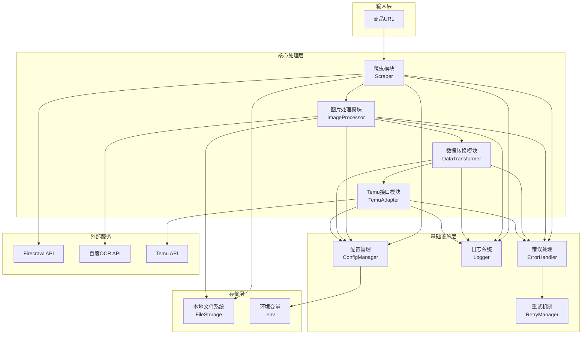
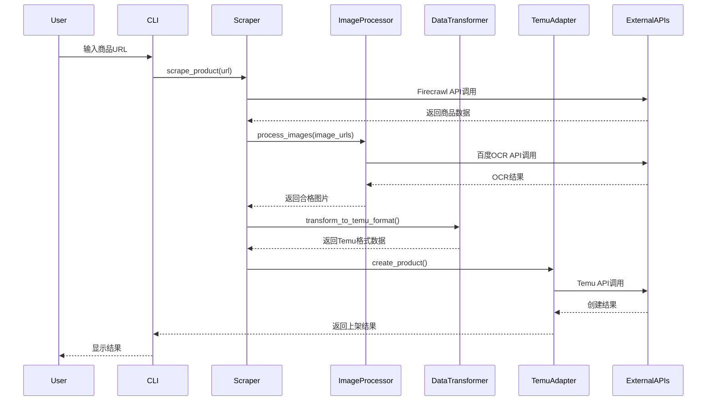

# DESIGN - AutoTemu 商品自动化上架系统

## 系统架构设计

### 整体架构图



### 分层设计

#### 1. 表现层（CLI）
- 命令行接口，接收用户输入的商品URL
- 显示处理进度和结果

#### 2. 业务逻辑层
- **爬虫模块**：负责商品信息抓取
- **图片处理模块**：OCR识别、图片筛选、尺寸调整
- **数据转换模块**：数据格式转换、价格计算、尺码映射
- **Temu接口模块**：API调用封装、商品上架

#### 3. 基础设施层
- **配置管理**：环境变量和配置文件管理
- **日志系统**：统一的日志记录
- **错误处理**：异常捕获和处理
- **重试机制**：网络请求重试

#### 4. 数据存储层
- **文件存储**：图片和临时数据存储
- **配置存储**：.env文件管理

## 核心组件设计

### 1. 爬虫模块（Scraper）

```python
class ProductScraper:
    def __init__(self, config: Config):
        self.firecrawl_client = Firecrawl(api_key=config.firecrawl_api_key)
        self.logger = Logger("scraper")
    
    def scrape_product(self, url: str) -> ProductData:
        """抓取商品信息"""
        pass
    
    def _parse_product_data(self, raw_data: dict) -> ProductData:
        """解析商品数据"""
        pass
```

**接口定义**：
- 输入：商品URL
- 输出：ProductData对象
- 异常：ScraperException

### 2. 图片处理模块（ImageProcessor）

```python
class ImageProcessor:
    def __init__(self, config: Config):
        self.ocr_client = BaiduOCR(config.baidu_api_key, config.baidu_secret_key)
        self.logger = Logger("image_processor")
    
    def process_images(self, image_urls: List[str]) -> ProcessedImages:
        """处理图片列表"""
        pass
    
    def _check_chinese(self, image_path: str) -> bool:
        """检测图片是否包含中文"""
        pass
    
    def _resize_image(self, image_path: str) -> str:
        """调整图片尺寸"""
        pass
```

**接口定义**：
- 输入：图片URL列表
- 输出：ProcessedImages对象（包含合格图片路径）
- 异常：ImageProcessException

### 3. 数据转换模块（DataTransformer）

```python
class DataTransformer:
    def __init__(self, config: Config):
        self.price_markup = config.price_markup
        self.size_mapper = SizeMapper()
        self.logger = Logger("transformer")
    
    def transform_to_temu_format(self, product_data: ProductData, images: ProcessedImages) -> TemuProductData:
        """转换为Temu商品格式"""
        pass
    
    def _calculate_price(self, original_price: float) -> float:
        """计算加价后的价格"""
        pass
    
    def _map_sizes(self, sizes: List[str]) -> List[TemuSKU]:
        """映射尺码信息"""
        pass
```

**接口定义**：
- 输入：ProductData, ProcessedImages
- 输出：TemuProductData对象
- 异常：TransformException

### 4. Temu接口模块（TemuAdapter）

```python
class TemuAdapter:
    def __init__(self, config: Config):
        self.client = TemuClient(
            config.temu_app_key,
            config.temu_app_secret,
            config.temu_access_token,
            config.temu_base_url
        )
        self.logger = Logger("temu_adapter")
    
    def create_product(self, product_data: TemuProductData) -> CreateProductResult:
        """创建商品"""
        pass
    
    def _recommend_category(self, product_name: str) -> int:
        """推荐商品分类"""
        pass
    
    def _upload_images(self, image_paths: List[str]) -> List[str]:
        """上传图片到Temu"""
        pass
```

**接口定义**：
- 输入：TemuProductData
- 输出：CreateProductResult
- 异常：TemuAPIException

## 数据流向图



## 接口契约定义

### 数据模型

```python
@dataclass
class ProductData:
    """爬取的商品数据"""
    name: str
    price: float
    description: str
    main_image_url: str
    detail_images: List[str]
    sizes: List[SizeInfo]
    product_code: Optional[str]

@dataclass
class SizeInfo:
    """尺码信息"""
    size_name: str
    size_image_url: Optional[str]
    measurements: Optional[Dict[str, float]]

@dataclass
class ProcessedImages:
    """处理后的图片"""
    main_image_path: str
    detail_image_paths: List[str]
    filtered_count: int  # 被过滤的图片数量

@dataclass
class TemuProductData:
    """Temu商品数据格式"""
    goods_basic: Dict
    goods_service_promise: Dict
    goods_property: Dict
    sku_list: List[Dict]
    bullet_points: Optional[List[str]]
    goods_desc: Optional[str]
    goods_size_chart_list: Optional[Dict]

@dataclass
class CreateProductResult:
    """商品创建结果"""
    success: bool
    goods_id: Optional[int]
    error_message: Optional[str]
    created_at: datetime
```

### 异常处理策略

```python
class AutoTemuException(Exception):
    """基础异常类"""
    pass

class ScraperException(AutoTemuException):
    """爬虫异常"""
    pass

class ImageProcessException(AutoTemuException):
    """图片处理异常"""
    pass

class TransformException(AutoTemuException):
    """数据转换异常"""
    pass

class TemuAPIException(AutoTemuException):
    """Temu API异常"""
    pass
```

### 重试策略

```python
class RetryPolicy:
    max_attempts: int = 3
    initial_delay: float = 1.0
    max_delay: float = 60.0
    exponential_base: float = 2.0
    
    def calculate_delay(self, attempt: int) -> float:
        """计算重试延迟时间"""
        delay = self.initial_delay * (self.exponential_base ** (attempt - 1))
        return min(delay, self.max_delay)
```

## 配置管理

### 环境变量（.env）

```ini
# Firecrawl配置
FIRECRAWL_API_KEY=your_firecrawl_api_key

# 百度OCR配置
BAIDU_API_KEY=your_baidu_api_key
BAIDU_SECRET_KEY=your_baidu_secret_key

# Temu API配置
TEMU_APP_KEY=your_temu_app_key
TEMU_APP_SECRET=your_temu_app_secret
TEMU_ACCESS_TOKEN=your_temu_access_token
TEMU_BASE_URL=https://openapi-jp.temu.com

# 业务配置
PRICE_MARKUP=1.3
LOG_LEVEL=INFO
IMAGE_SAVE_PATH=./images
```

### 配置类设计

```python
class Config:
    def __init__(self):
        load_dotenv()
        
        # API配置
        self.firecrawl_api_key = os.getenv("FIRECRAWL_API_KEY")
        self.baidu_api_key = os.getenv("BAIDU_API_KEY")
        self.baidu_secret_key = os.getenv("BAIDU_SECRET_KEY")
        self.temu_app_key = os.getenv("TEMU_APP_KEY")
        self.temu_app_secret = os.getenv("TEMU_APP_SECRET")
        self.temu_access_token = os.getenv("TEMU_ACCESS_TOKEN")
        self.temu_base_url = os.getenv("TEMU_BASE_URL")
        
        # 业务配置
        self.price_markup = float(os.getenv("PRICE_MARKUP", "1.3"))
        self.log_level = os.getenv("LOG_LEVEL", "INFO")
        self.image_save_path = os.getenv("IMAGE_SAVE_PATH", "./images")
```

## 日志设计

```python
import logging
from datetime import datetime

class Logger:
    def __init__(self, module_name: str):
        self.logger = logging.getLogger(module_name)
        handler = logging.FileHandler(f"logs/{datetime.now().strftime('%Y%m%d')}_autotemu.log")
        formatter = logging.Formatter(
            '%(asctime)s - %(name)s - %(levelname)s - %(message)s'
        )
        handler.setFormatter(formatter)
        self.logger.addHandler(handler)
```

## 目录结构

```
AutoTemu/
├── src/
│   ├── __init__.py
│   ├── main.py              # 主程序入口
│   ├── scraper/             # 爬虫模块
│   │   ├── __init__.py
│   │   └── product_scraper.py
│   ├── image/               # 图片处理模块
│   │   ├── __init__.py
│   │   ├── processor.py
│   │   └── ocr_client.py
│   ├── transformer/         # 数据转换模块
│   │   ├── __init__.py
│   │   ├── data_transformer.py
│   │   └── size_mapper.py
│   ├── temu/                # Temu接口模块
│   │   ├── __init__.py
│   │   └── adapter.py
│   ├── utils/               # 工具模块
│   │   ├── __init__.py
│   │   ├── config.py
│   │   ├── logger.py
│   │   └── retry.py
│   └── models/              # 数据模型
│       ├── __init__.py
│       └── data_models.py
├── tests/                   # 测试目录
├── logs/                    # 日志目录
├── images/                  # 图片存储目录
├── docs/                    # 文档目录
├── requirements.txt         # 依赖列表
├── .env.example            # 环境变量示例
├── .gitignore
└── README.md
```

## 设计原则

1. **单一职责**：每个模块只负责一个功能
2. **依赖倒置**：高层模块不依赖低层模块，都依赖抽象
3. **开闭原则**：对扩展开放，对修改关闭
4. **错误优先**：优先处理异常情况
5. **日志完备**：关键操作都有日志记录
