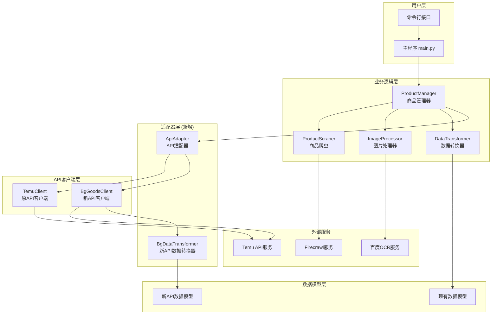
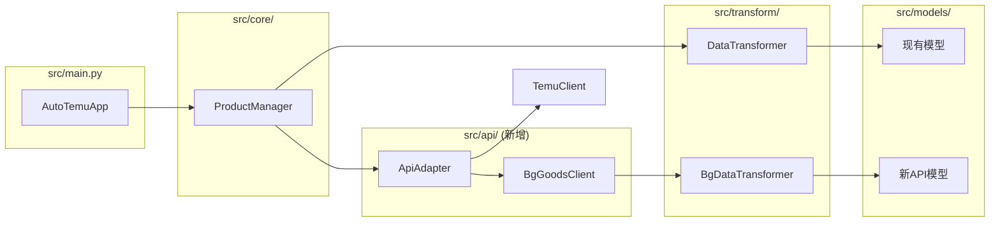
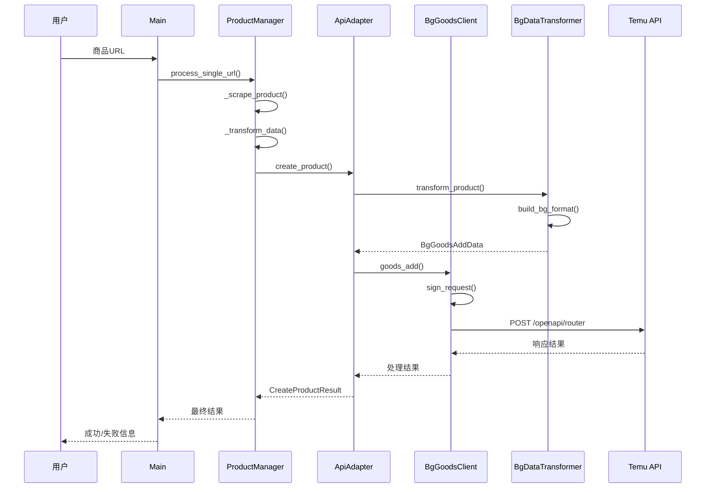

# DESIGN - AutoTemu 货品发布API更新系统架构设计

## 整体架构图



## 分层设计和核心组件

### 1. 用户层 (User Layer)
**职责**: 用户交互和程序入口
- `main.py` - 主程序入口，命令行参数处理
- CLI接口 - 用户命令行交互

### 2. 业务逻辑层 (Business Logic Layer)
**职责**: 核心业务逻辑处理
- `ProductManager` - 商品管理核心逻辑，协调各个模块
- `DataTransformer` - 数据转换和验证
- `ImageProcessor` - 图片处理和OCR识别
- `ProductScraper` - 商品信息爬取

### 3. 适配器层 (Adapter Layer) **[新增]**
**职责**: 新旧API的适配和转换
- `ApiAdapter` - 统一的API适配器接口
- `BgDataTransformer` - 新API数据格式转换器

### 4. API客户端层 (API Client Layer)
**职责**: 外部API调用封装
- `BgGoodsClient` - 新的bg.goods.add API客户端 **[新增]**
- `TemuClient` - 原有的temu_api客户端 **[保留]**

### 5. 数据模型层 (Data Model Layer)
**职责**: 数据结构定义和验证
- 现有数据模型 - `ProductData`, `TemuProduct`, `TemuSKU` 等
- 新API数据模型 - `BgGoodsAddData`, `BgProductSkcReq` 等 **[新增]**

## 模块依赖关系图



## 接口契约定义

### 1. ApiAdapter 接口
```python
class ApiAdapter:
    def create_product(self, product_data: Union[dict, TemuProduct]) -> CreateProductResult:
        """统一的商品创建接口"""
        pass
    
    def upload_image(self, image_url: str) -> str:
        """统一的图片上传接口"""
        pass
    
    def get_categories(self, parent_id: int = 0) -> List[dict]:
        """统一的分类查询接口"""
        pass
    
    def recommend_category(self, product_name: str, description: str = None) -> dict:
        """统一的分类推荐接口"""
        pass
```

### 2. BgGoodsClient 接口
```python
class BgGoodsClient:
    def __init__(self, app_key: str, app_secret: str, access_token: str):
        """初始化客户端"""
        pass
    
    def sign_request(self, params: dict) -> str:
        """生成API签名"""
        pass
    
    def make_request(self, method: str, params: dict) -> dict:
        """发送API请求"""
        pass
    
    def goods_add(self, product_data: BgGoodsAddData) -> dict:
        """调用bg.goods.add接口"""
        pass
    
    def image_upload(self, file_url: str, scaling_type: int = 1) -> str:
        """上传图片"""
        pass
    
    def sizecharts_create(self, size_data: dict) -> str:
        """创建尺码表"""
        pass
    
    def category_recommend(self, goods_name: str, description: str = None) -> dict:
        """分类推荐"""
        pass
    
    def template_get(self, cat_id: str) -> dict:
        """获取分类模板"""
        pass
    
    def spec_id_get(self, cat_id: int, parent_spec_id: int, child_spec_name: str) -> dict:
        """获取规格ID"""
        pass
```

### 3. BgDataTransformer 接口
```python
class BgDataTransformer:
    def transform_product(self, temu_product: TemuProduct) -> BgGoodsAddData:
        """转换商品数据为新API格式"""
        pass
    
    def build_product_skc_reqs(self, temu_product: TemuProduct) -> List[BgProductSkcReq]:
        """构建SKC请求数据"""
        pass
    
    def build_product_sku_reqs(self, skus: List[TemuSKU]) -> List[BgProductSkuReq]:
        """构建SKU请求数据"""
        pass
    
    def build_product_properties(self, template: dict, product: TemuProduct) -> List[dict]:
        """构建商品属性"""
        pass
```

## 数据流向图



## 异常处理策略

### 1. 异常分层处理
```python
# API层异常
class BgApiException(AutoTemuException):
    """新API相关异常"""
    pass

class SignatureException(BgApiException):
    """签名相关异常"""
    pass

class RequestException(BgApiException):
    """请求相关异常"""
    pass

# 业务层异常处理
class ApiAdapter:
    def create_product(self, product_data) -> CreateProductResult:
        try:
            if self.use_new_api:
                return self._create_with_new_api(product_data)
            else:
                return self._create_with_old_api(product_data)
        except BgApiException as e:
            logger.error(f"新API调用失败: {e}")
            # 可选：降级到旧API
            if self.fallback_enabled:
                return self._create_with_old_api(product_data)
            raise
        except Exception as e:
            logger.error(f"商品创建异常: {e}")
            raise AutoTemuException(f"商品创建失败: {e}")
```

### 2. 重试机制
```python
from src.utils.retry import api_retry

class BgGoodsClient:
    @api_retry(max_attempts=3, backoff_factor=2)
    def goods_add(self, product_data: BgGoodsAddData) -> dict:
        """带重试的商品创建"""
        return self._make_goods_add_request(product_data)
    
    @api_retry(max_attempts=5, backoff_factor=1.5)
    def image_upload(self, file_url: str) -> str:
        """带重试的图片上传"""
        return self._make_image_upload_request(file_url)
```

## 配置管理扩展

### 1. 配置项增加
```python
# src/utils/config.py
class Config:
    # 现有配置...
    
    # 新API配置
    use_new_api: bool = True
    bg_app_key: str = ""
    bg_app_secret: str = ""
    bg_access_token: str = ""
    bg_base_url: str = "https://openapi.kuajingmaihuo.com/openapi/router"
    
    # API切换配置
    api_fallback_enabled: bool = True
    api_timeout: int = 30
    api_max_retries: int = 3
    
    # 新API特定配置
    bg_scaling_type: int = 1  # 图片缩放类型
    bg_compression_type: int = 1  # 图片压缩类型
    bg_format_conversion_type: int = 0  # 图片格式转换类型
```

### 2. 环境变量映射
```bash
# .env文件新增
USE_NEW_API=true
BG_APP_KEY=your_app_key
BG_APP_SECRET=your_app_secret
BG_ACCESS_TOKEN=your_access_token
BG_BASE_URL=https://openapi.kuajingmaihuo.com/openapi/router
API_FALLBACK_ENABLED=true
```

## 新增文件结构

```
src/
├── api/                    # API客户端模块
│   ├── __init__.py
│   ├── bg_client.py       # 新API客户端 [新增]
│   └── api_adapter.py     # API适配器 [新增]
├── models/
│   ├── bg_models.py       # 新API数据模型 [新增]
│   └── ...                # 现有模型文件
├── transform/
│   ├── bg_transformer.py  # 新API数据转换器 [新增]
│   └── ...                # 现有转换器文件
└── utils/
    ├── bg_signature.py    # 新API签名工具 [新增]
    └── ...                # 现有工具文件
```

## 设计原则验证

### 1. 单一职责原则 (SRP)
- ✅ `BgGoodsClient` 专门负责新API调用
- ✅ `BgDataTransformer` 专门负责数据格式转换
- ✅ `ApiAdapter` 专门负责API适配

### 2. 开闭原则 (OCP)
- ✅ 通过适配器模式支持新API，无需修改现有代码
- ✅ 通过配置支持API切换，扩展性强

### 3. 依赖倒置原则 (DIP)
- ✅ `ProductManager` 依赖 `ApiAdapter` 抽象接口
- ✅ 具体API实现可灵活切换

### 4. 接口隔离原则 (ISP)
- ✅ 不同功能的接口分离定义
- ✅ 客户端只依赖需要的接口

## 性能和可维护性考虑

### 1. 性能优化
- **连接池**: HTTP连接复用
- **缓存机制**: 分类、模板等数据缓存
- **并发处理**: 图片上传并发处理
- **超时控制**: 合理的API超时设置

### 2. 可维护性
- **模块化设计**: 清晰的模块边界
- **配置驱动**: 减少硬编码
- **日志记录**: 完整的操作日志
- **错误处理**: 统一的异常处理机制

### 3. 可测试性
- **依赖注入**: 便于单元测试
- **Mock友好**: 接口设计支持Mock
- **集成测试**: 端到端测试支持

## 迁移策略

### 1. 渐进式迁移
1. **阶段1**: 创建新的API客户端和数据模型
2. **阶段2**: 实现适配器层，支持API切换
3. **阶段3**: 更新业务逻辑，使用适配器
4. **阶段4**: 测试验证，优化性能
5. **阶段5**: 正式切换到新API

### 2. 风险控制
- **配置切换**: 支持运行时API切换
- **降级机制**: 新API失败时自动降级
- **监控告警**: 完整的错误监控
- **回滚方案**: 快速回滚到旧API

### 3. 验证方法
- **单元测试**: 覆盖核心逻辑
- **集成测试**: 验证API调用
- **端到端测试**: 验证完整流程
- **性能测试**: 验证性能指标