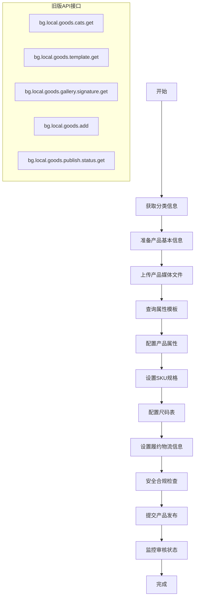
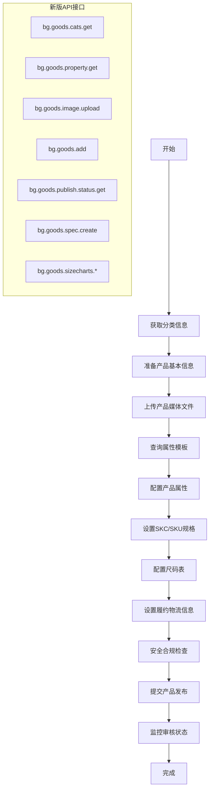

# FLOW COMPARISON - AutoTemu 新旧商品上架流程对比分析

## 文档概述

**创建日期**: 2025-01-10  
**目的**: 对比分析旧版 `bg.local.goods.add` 流程与新版 `bg.goods.add` 半托管发品流程的差异  
**适用范围**: AutoTemu 系统升级改造  

---

## 1. 流程架构对比

### 1.1 旧版流程架构 (bg.local.goods.add)



### 1.2 新版流程架构 (bg.goods.add)



---

## 2. 核心差异分析

### 2.1 API接口变化

| 功能模块 | 旧版接口 | 新版接口 | 变化说明 |
|----------|----------|----------|----------|
| 分类查询 | `bg.local.goods.cats.get` | `bg.goods.cats.get` | 接口名称简化 |
| 属性模板 | `bg.local.goods.template.get` | `bg.goods.property.get` | 接口名称变更 |
| 图片上传 | `bg.local.goods.gallery.signature.get` | `bg.goods.image.upload` | 上传方式改变 |
| 产品发布 | `bg.local.goods.add` | `bg.goods.add` | 数据结构大幅变化 |
| 规格创建 | `bg.local.goods.spec.id.get` | `bg.goods.spec.create` | 接口名称变更 |
| 尺码表 | `bg.local.goods.size.element.get` | `bg.goods.sizecharts.*` | 接口组变化 |

### 2.2 数据结构变化

#### 2.2.1 旧版数据结构 (bg.local.goods.add)

```json
{
  "goodsBasic": {
    "goodsName": "产品名称",
    "goodsDesc": "产品描述",
    "catId": 12345,
    "outGoodsSn": "商品编号"
  },
  "goodsServicePromise": {
    "prepareTime": 1,
    "costTemplateId": 12345,
    "importDesignation": "Imported"
  },
  "goodsProperty": [
    {
      "templatePid": 123,
      "pid": 456,
      "vid": 789,
      "value": "属性值"
    }
  ],
  "skuList": [
    {
      "outSkuSn": "SKU编号",
      "specIdList": [1001, 2001],
      "skuPreviewGallery": ["图片URL"],
      "listPrice": "15.99",
      "salePrice": "19.99"
    }
  ]
}
```

#### 2.2.2 新版数据结构 (bg.goods.add)

```json
{
  "productName": "产品名称",
  "cat1Id": 1,
  "cat2Id": 2,
  "cat3Id": 3,
  "carouselImageUrls": ["图片URL"],
  "materialImgUrl": "素材图URL",
  "productPropertyReqs": [
    {
      "templatePid": 123,
      "pid": 456,
      "vid": 789,
      "propValue": "属性值"
    }
  ],
  "productSkcReqs": [
    {
      "previewImgUrls": ["SKC预览图"],
      "productSkuReqs": [
        {
          "thumbUrl": "SKU缩略图",
          "currencyType": "JPY",
          "supplierPrice": 1999,
          "productSkuSpecReqs": [
            {
              "specId": 1001,
              "specName": "M"
            }
          ]
        }
      ]
    }
  ]
}
```

### 2.3 关键概念变化

#### 2.3.1 SKU/SKC 概念变化

**旧版**: 直接管理SKU
- SKU包含所有信息（规格、价格、图片等）
- 扁平化结构

**新版**: SKC + SKU 分层管理
- SKC (Stock Keeping Color): 颜色/款式维度
- SKU (Stock Keeping Unit): 具体规格维度
- 层次化结构

#### 2.3.2 图片管理变化

**旧版**: 统一图片管理
- 所有图片通过 `goodsGalleryList` 管理
- 图片类型通过 `galleryType` 区分

**新版**: 分类图片管理
- 轮播图: `carouselImageUrls`
- 素材图: `materialImgUrl`
- SKC图片: `previewImgUrls`
- SKU图片: `thumbUrl`

#### 2.3.3 属性管理变化

**旧版**: 简单属性结构
- 属性值通过 `value` 字段
- 选择类型通过 `vid` 字段

**新版**: 复杂属性结构
- 属性值通过 `propValue` 字段
- 支持更多属性类型和验证规则

---

## 3. 功能特性对比

### 3.1 托管模式支持

| 特性 | 旧版 | 新版 | 说明 |
|------|------|------|------|
| 全托管模式 | ✅ 支持 | ✅ 支持 | 平台负责履约 |
| 半托管模式 | ❌ 不支持 | ✅ 支持 | 商家负责履约 |
| 混合模式 | ❌ 不支持 | ✅ 支持 | 部分SKU半托管 |

### 3.2 多语言支持

| 特性 | 旧版 | 新版 | 说明 |
|------|------|------|------|
| 英文支持 | ✅ 支持 | ✅ 支持 | 基础语言 |
| 多语言标题 | ❌ 不支持 | ✅ 支持 | `productI18nReqs` |
| 多语言图片 | ❌ 不支持 | ✅ 支持 | `carouselImageI18nReqs` |

### 3.3 图片处理能力

| 特性 | 旧版 | 新版 | 说明 |
|------|------|------|------|
| 图片上传 | 签名上传 | 直接上传 | 简化流程 |
| 图片规格 | 固定规格 | 动态规格 | 更灵活 |
| 图片压缩 | 手动处理 | 自动处理 | 平台优化 |

### 3.4 价格管理

| 特性 | 旧版 | 新版 | 说明 |
|------|------|------|------|
| 基础价格 | 字符串 | 整数 | 精度提升 |
| 货币类型 | 固定USD | 多币种 | 支持JPY等 |
| 价格建议 | 简单 | 复杂 | 更智能 |

---

## 4. 技术实现差异

### 4.1 签名算法

#### 旧版签名算法
```python
def generate_signature_old(params, app_secret):
    # 简单的MD5签名
    sorted_params = sorted(params.items())
    base_string = ''.join([f"{k}{v}" for k, v in sorted_params])
    return hashlib.md5(f"{app_secret}{base_string}{app_secret}".encode()).hexdigest()
```

#### 新版签名算法
```python
def generate_signature_new(params, app_secret):
    # 复杂的MD5/HEX签名
    params_to_sign = {k: v for k, v in params.items() if k != 'sign'}
    sorted_items = sorted(params_to_sign.items(), key=lambda x: x[0])
    
    base_string_parts = []
    for k, v in sorted_items:
        if isinstance(v, (dict, list)):
            base_string_parts.append(f"{k}{json.dumps(v, separators=(',', ':'), ensure_ascii=False)}")
        else:
            base_string_parts.append(f"{k}{v}")
    
    base = ''.join(base_string_parts)
    raw_string = f"{app_secret}{base}{app_secret}"
    return hashlib.md5(raw_string.encode('utf-8')).hexdigest()
```

### 4.2 错误处理

#### 旧版错误处理
- 简单的错误码映射
- 基础的重试机制
- 有限的错误恢复

#### 新版错误处理
- 详细的错误分类
- 智能重试策略
- 自动错误恢复

### 4.3 数据验证

#### 旧版数据验证
- 基础字段验证
- 简单的类型检查
- 有限的业务规则

#### 新版数据验证
- 复杂的数据结构验证
- 严格的类型检查
- 丰富的业务规则

---

## 5. 迁移策略建议

### 5.1 渐进式迁移

1. **阶段1**: 保持旧版API兼容
   - 继续支持 `bg.local.goods.add`
   - 添加新版API支持
   - 双API并行运行

2. **阶段2**: 逐步切换到新版API
   - 新商品使用新版API
   - 旧商品继续使用旧版API
   - 数据格式转换

3. **阶段3**: 完全迁移到新版API
   - 停止旧版API支持
   - 清理旧版代码
   - 优化新版实现

### 5.2 数据转换策略

#### 5.2.1 商品数据转换
```python
def convert_old_to_new_product(old_product):
    return {
        "productName": old_product["goodsBasic"]["goodsName"],
        "cat1Id": extract_cat_id(old_product["goodsBasic"]["catId"], 1),
        "cat2Id": extract_cat_id(old_product["goodsBasic"]["catId"], 2),
        "cat3Id": extract_cat_id(old_product["goodsBasic"]["catId"], 3),
        "carouselImageUrls": old_product["goodsGalleryList"],
        "materialImgUrl": old_product["goodsGalleryList"][0] if old_product["goodsGalleryList"] else "",
        "productPropertyReqs": convert_properties(old_product["goodsProperty"]),
        "productSkcReqs": convert_skus_to_skcs(old_product["skuList"])
    }
```

#### 5.2.2 SKU数据转换
```python
def convert_skus_to_skcs(sku_list):
    # 按规格分组创建SKC
    skc_groups = {}
    for sku in sku_list:
        # 根据规格组合分组
        key = tuple(sku["specIdList"])
        if key not in skc_groups:
            skc_groups[key] = []
        skc_groups[key].append(sku)
    
    skc_reqs = []
    for group_key, skus in skc_groups.items():
        skc_req = {
            "previewImgUrls": skus[0]["skuPreviewGallery"][:3],
            "productSkuReqs": []
        }
        
        for sku in skus:
            sku_req = {
                "thumbUrl": sku["skuPreviewGallery"][0],
                "currencyType": "JPY",
                "supplierPrice": int(float(sku["salePrice"]) * 100),  # 转换为分
                "productSkuSpecReqs": [
                    {"specId": spec_id, "specName": get_spec_name(spec_id)}
                    for spec_id in sku["specIdList"]
                ]
            }
            skc_req["productSkuReqs"].append(sku_req)
        
        skc_reqs.append(skc_req)
    
    return skc_reqs
```

### 5.3 兼容性保证

#### 5.3.1 API适配器模式
```python
class ProductAPIAdapter:
    def __init__(self, use_new_api=True):
        self.use_new_api = use_new_api
        if use_new_api:
            self.client = BgGoodsClient()
        else:
            self.client = TemuClient()
    
    def create_product(self, product_data):
        if self.use_new_api:
            return self.client.goods_add(product_data)
        else:
            return self.client.goods_add_legacy(product_data)
```

#### 5.3.2 配置驱动切换
```python
# 环境变量控制API版本
API_VERSION = os.getenv("TEMU_API_VERSION", "new")  # new, old, both

if API_VERSION == "new":
    api_client = BgGoodsClient()
elif API_VERSION == "old":
    api_client = TemuClient()
else:  # both
    api_client = ProductAPIAdapter(use_new_api=True)
```

---

## 6. 风险评估与缓解

### 6.1 技术风险

| 风险类型 | 风险等级 | 影响 | 缓解措施 |
|----------|----------|------|----------|
| API兼容性 | 高 | 功能中断 | 双API支持，渐进迁移 |
| 数据格式 | 中 | 数据丢失 | 数据转换验证，备份机制 |
| 性能影响 | 中 | 响应延迟 | 性能测试，优化实现 |
| 错误处理 | 低 | 用户体验 | 完善错误处理，用户提示 |

### 6.2 业务风险

| 风险类型 | 风险等级 | 影响 | 缓解措施 |
|----------|----------|------|----------|
| 商品发布中断 | 高 | 业务停滞 | 回滚机制，紧急修复 |
| 数据不一致 | 中 | 数据质量 | 数据同步，一致性检查 |
| 用户体验 | 中 | 用户流失 | 用户培训，支持文档 |
| 合规问题 | 低 | 法律风险 | 合规检查，法律审查 |

---

## 7. 实施计划

### 7.1 时间线

| 阶段 | 时间 | 主要任务 | 交付物 |
|------|------|----------|--------|
| 准备阶段 | 1-2周 | 环境搭建，代码分析 | 技术方案 |
| 开发阶段 | 3-4周 | 新版API实现 | 新版代码 |
| 测试阶段 | 2-3周 | 功能测试，性能测试 | 测试报告 |
| 部署阶段 | 1周 | 生产部署，监控 | 部署文档 |
| 优化阶段 | 持续 | 性能优化，问题修复 | 优化报告 |

### 7.2 里程碑

- [ ] **M1**: 新版API客户端完成
- [ ] **M2**: 数据转换器完成
- [ ] **M3**: 集成测试通过
- [ ] **M4**: 生产环境部署
- [ ] **M5**: 性能优化完成

---

## 8. 总结

### 8.1 主要变化

1. **API接口**: 从 `bg.local.*` 迁移到 `bg.goods.*`
2. **数据结构**: 从简单结构迁移到复杂嵌套结构
3. **功能特性**: 新增半托管模式、多语言支持等
4. **技术实现**: 签名算法、错误处理、数据验证等全面升级

### 8.2 迁移建议

1. **采用渐进式迁移策略**，确保业务连续性
2. **实现API适配器模式**，支持双API并行
3. **完善数据转换机制**，保证数据完整性
4. **建立监控和回滚机制**，降低迁移风险

### 8.3 预期收益

1. **功能增强**: 支持更多业务场景
2. **性能提升**: 更高效的API调用
3. **维护性**: 更清晰的代码结构
4. **扩展性**: 更好的未来扩展能力

---

**文档版本**: v1.0  
**最后更新**: 2025-01-10  
**维护人员**: AutoTemu开发团队
