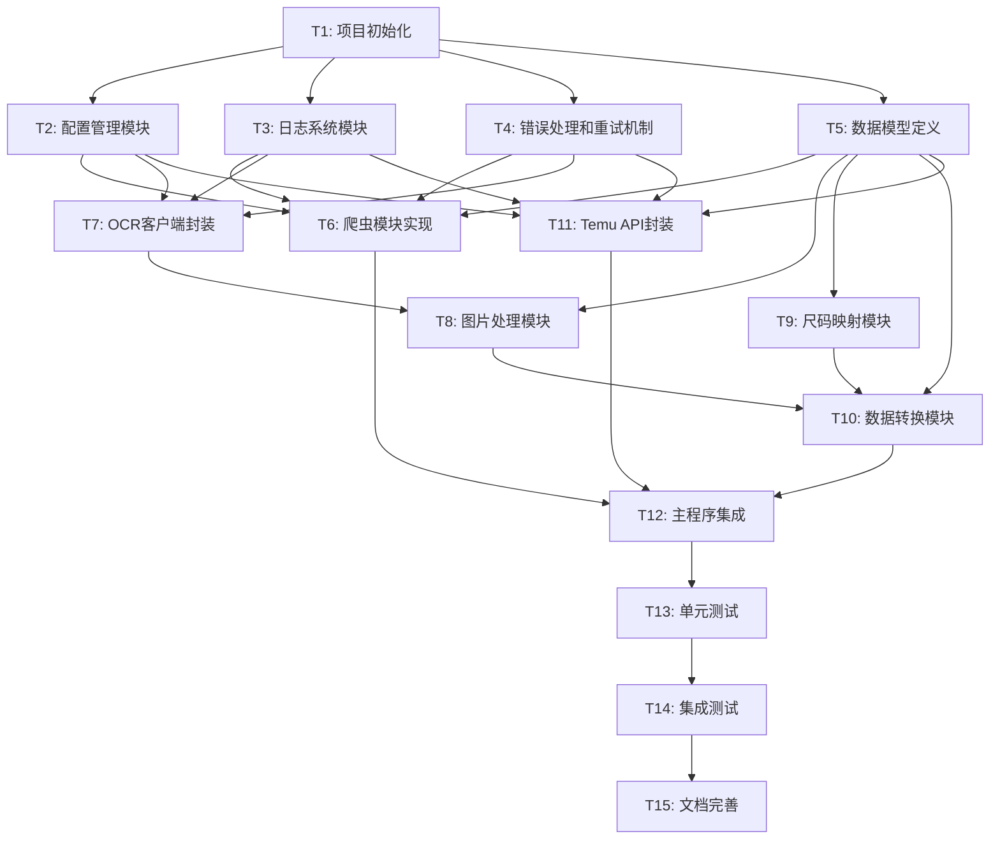

# TASK - AutoTemu 商品自动化上架系统

## 任务拆分概览

本文档将AutoTemu项目拆分为可独立实现和验证的原子任务。每个任务都有明确的输入、输出和验收标准。

## 任务依赖图

## 原子任务列表

### T1: 项目初始化

**输入契约**：
- 项目需求文档
- 技术选型方案

**输出契约**：
- 完整的项目目录结构
- requirements.txt文件
- .env.example文件
- .gitignore文件
- 基础README.md

**实现约束**：
- Python 3.8+
- 使用venv虚拟环境
- 遵循PEP8编码规范

**验收标准**：
- ✓ 能够成功创建虚拟环境并安装依赖
- ✓ 目录结构符合设计文档
- ✓ .env.example包含所有必需的环境变量

---

### T2: 配置管理模块

**输入契约**：
- 环境变量需求列表
- 配置项定义

**输出契约**：
- src/utils/config.py
- 完整的Config类实现
- 配置验证功能

**实现约束**：
- 使用python-dotenv库
- 配置项类型安全
- 缺失必要配置时抛出明确异常

**验收标准**：
- ✓ 能够正确加载.env文件
- ✓ 配置缺失时有明确错误提示
- ✓ 支持默认值设置

---

### T3: 日志系统模块

**输入契约**：
- 日志级别配置
- 日志格式要求

**输出契约**：
- src/utils/logger.py
- Logger类实现
- 日志文件自动创建和轮转

**实现约束**：
- 使用Python logging模块
- 支持按日期分割日志文件
- 同时输出到控制台和文件

**验收标准**：
- ✓ 日志按模块分类
- ✓ 日志格式包含时间、级别、模块、消息
- ✓ 日志文件按日期组织

---

### T4: 错误处理和重试机制

**输入契约**：
- 异常类型定义
- 重试策略配置

**输出契约**：
- src/utils/exceptions.py
- src/utils/retry.py
- 自定义异常类
- 重试装饰器

**实现约束**：
- 指数退避算法
- 最大重试次数限制
- 可配置的重试条件

**验收标准**：
- ✓ 网络异常自动重试
- ✓ 重试延迟递增
- ✓ 达到最大次数后抛出异常

---

### T5: 数据模型定义

**输入契约**：
- 商品数据结构
- Temu API数据格式

**输出契约**：
- src/models/data_models.py
- 所有数据类定义
- 数据验证方法

**实现约束**：
- 使用dataclass
- 类型注解完整
- 支持JSON序列化

**验收标准**：
- ✓ 数据模型覆盖所有业务场景
- ✓ 支持与JSON互转
- ✓ 字段验证完善

---

### T6: 爬虫模块实现

**输入契约**：
- Firecrawl API文档
- 商品数据提取规则
- 已有的scrape_firecrawl.py代码

**输出契约**：
- src/scraper/product_scraper.py
- ProductScraper类
- 结构化的商品数据

**实现约束**：
- 基于现有Firecrawl实现
- 错误处理完善
- 支持自定义提取规则

**验收标准**：
- ✓ 成功抓取jp0663.com商品
- ✓ 数据结构完整
- ✓ 网络异常有重试

---

### T7: OCR客户端封装

**输入契约**：
- 百度OCR API文档
- 中文检测需求

**输出契约**：
- src/image/ocr_client.py
- BaiduOCR类
- 中文检测方法

**实现约束**：
- 封装百度OCR API
- Token自动获取和缓存
- 请求频率控制

**验收标准**：
- ✓ OCR识别准确
- ✓ 中文检测可靠
- ✓ API调用稳定

---

### T8: 图片处理模块

**输入契约**：
- 图片URL列表
- Temu图片要求规范
- OCR客户端接口

**输出契约**：
- src/image/processor.py
- ImageProcessor类
- 处理后的图片文件

**实现约束**：
- 使用Pillow库
- 保持3:4比例
- 图片大小≤2M

**验收标准**：
- ✓ 正确过滤中文图片
- ✓ 图片尺寸符合要求
- ✓ 保存路径组织合理

---

### T9: 尺码映射模块

**输入契约**：
- 源网站尺码数据
- Temu尺码规范

**输出契约**：
- src/transformer/size_mapper.py
- SizeMapper类
- 尺码映射规则

**实现约束**：
- 支持灵活配置
- 处理缺失尺码
- 生成标准尺码表

**验收标准**：
- ✓ 正确映射常见尺码
- ✓ 生成符合Temu要求的尺码表
- ✓ 处理特殊尺码情况

---

### T10: 数据转换模块

**输入契约**：
- 爬取的商品数据
- 处理后的图片信息
- 尺码映射结果

**输出契约**：
- src/transformer/data_transformer.py
- DataTransformer类
- Temu格式的商品数据

**实现约束**：
- 价格加价30%
- 数据完整性验证
- 字段映射准确

**验收标准**：
- ✓ 数据格式符合Temu API要求
- ✓ 价格计算正确
- ✓ 必填字段完整

---

### T11: Temu API封装

**输入契约**：
- Temu API SDK
- API认证信息
- 商品数据格式

**输出契约**：
- src/temu/adapter.py
- TemuAdapter类
- 商品创建功能

**实现约束**：
- 基于temu_api库
- 错误处理完善
- 支持类目推荐

**验收标准**：
- ✓ 成功调用类目推荐API
- ✓ 图片上传功能正常
- ✓ 商品创建成功

---

### T12: 主程序集成

**输入契约**：
- 所有模块接口
- 命令行参数需求

**输出契约**：
- src/main.py
- 完整的处理流程
- 命令行接口

**实现约束**：
- 使用argparse处理参数
- 完整的异常处理
- 友好的用户提示

**验收标准**：
- ✓ 端到端流程通畅
- ✓ 错误信息清晰
- ✓ 处理结果明确

---

### T13: 单元测试

**输入契约**：
- 各模块接口定义
- 测试用例设计

**输出契约**：
- tests/目录下的测试文件
- 每个模块的单元测试
- Mock数据和fixtures

**实现约束**：
- 使用pytest框架
- 测试覆盖率>80%
- Mock外部API调用

**验收标准**：
- ✓ 所有测试通过
- ✓ 覆盖主要功能
- ✓ 边界条件测试

---

### T14: 集成测试

**输入契约**：
- 完整的系统实现
- 测试数据准备

**输出契约**：
- 端到端测试脚本
- 测试报告
- 性能指标

**实现约束**：
- 真实API调用测试
- 完整流程验证
- 异常场景测试

**验收标准**：
- ✓ 商品成功上架
- ✓ 数据转换正确
- ✓ 错误处理有效

---

### T15: 文档完善

**输入契约**：
- 项目代码
- API使用经验
- 部署步骤

**输出契约**：
- README.md更新
- API使用指南
- 部署文档
- 故障排查指南

**实现约束**：
- 文档清晰易懂
- 包含实际示例
- 覆盖常见问题

**验收标准**：
- ✓ 新用户能够快速上手
- ✓ 部署步骤完整
- ✓ 故障排查有效

## 任务优先级

1. **P0 - 基础设施**：T1, T2, T3, T4, T5
2. **P1 - 核心功能**：T6, T7, T8, T9, T10, T11
3. **P2 - 集成交付**：T12, T13, T14, T15

## 风险评估

1. **T6 爬虫模块**：网站结构变化可能导致抓取失败
2. **T7 OCR客户端**：API限流可能影响处理速度
3. **T11 Temu API**：API变更可能需要调整实现
4. **T8 图片处理**：大量图片处理可能消耗较多资源

## 里程碑

1. **M1 - 基础架构完成**：T1-T5完成
2. **M2 - 核心模块完成**：T6-T11完成
3. **M3 - 系统集成完成**：T12完成
4. **M4 - 项目交付**：T13-T15完成
