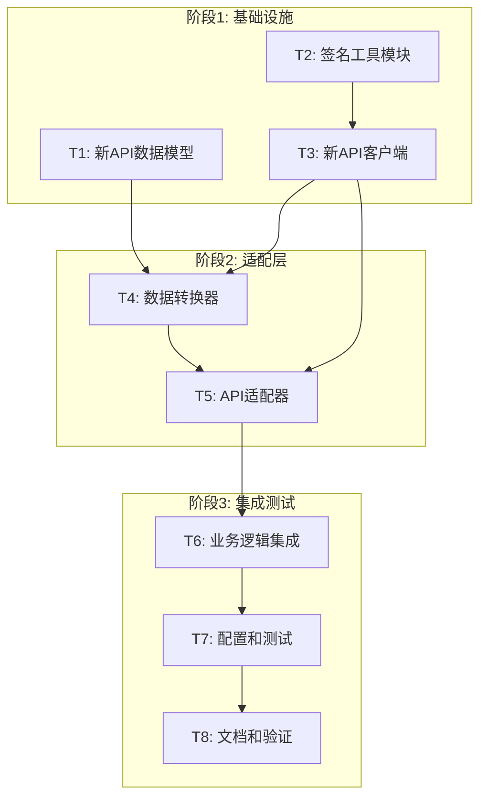

# TASK - AutoTemu 货品发布API更新任务拆分

## 任务总览

基于DESIGN文档的架构设计，将更新工作拆分为8个原子任务，按依赖关系分为3个阶段执行。

## 任务依赖图



## 阶段1: 基础设施 (并行执行)

### T1: 新API数据模型创建
**复杂度**: 中等 | **预估时间**: 2-3小时 | **优先级**: 高

#### 输入契约
- **前置依赖**: 无
- **输入数据**: 
  - `docs/货品发布.md` 文档中的API参数规范
  - 现有数据模型结构 (`src/models/data_models.py`)
- **环境依赖**: Python开发环境

#### 输出契约
- **输出数据**: 
  - `src/models/bg_models.py` - 新API数据模型文件
  - 完整的数据模型类: `BgGoodsAddData`, `BgProductSkcReq`, `BgProductSkuReq` 等
- **交付物**: 
  - 数据模型类定义
  - 数据验证方法
  - 序列化/反序列化方法
- **验收标准**: 
  - 所有必需字段正确定义
  - 数据类型匹配API要求
  - 包含完整的类型注解
  - 通过单元测试

#### 实现约束
- **技术栈**: Python dataclass, typing
- **接口规范**: 遵循现有数据模型设计模式
- **质量要求**: 
  - 100%类型注解覆盖
  - 完整的docstring文档
  - 字段验证方法

#### 依赖关系
- **后置任务**: T4 (需要数据模型进行转换)
- **并行任务**: T2, T3

---

### T2: 签名工具模块实现
**复杂度**: 中等 | **预估时间**: 2-3小时 | **优先级**: 高

#### 输入契约
- **前置依赖**: 无
- **输入数据**: 
  - `docs/货品发布.md` 中的签名算法规范
  - 现有的签名机制参考
- **环境依赖**: Python开发环境, hashlib库

#### 输出契约
- **输出数据**: 
  - `src/utils/bg_signature.py` - 签名工具模块
  - 签名算法实现
- **交付物**: 
  - `sign_request()` 函数
  - 参数排序和编码逻辑
  - 时间戳处理功能
- **验收标准**: 
  - 签名算法正确实现
  - 支持参数排序和编码
  - 处理时区和编码问题
  - 通过签名验证测试

#### 实现约束
- **技术栈**: Python, hashlib, time
- **接口规范**: 
  ```python
  def sign_request(params: dict, app_secret: str) -> str:
      """生成API请求签名"""
      pass
  ```
- **质量要求**: 
  - 严格按照文档算法实现
  - 处理边界情况
  - 支持调试模式

#### 依赖关系
- **后置任务**: T3 (API客户端需要签名功能)
- **并行任务**: T1, T3

---

### T3: 新API客户端实现
**复杂度**: 高 | **预估时间**: 4-5小时 | **优先级**: 高

#### 输入契约
- **前置依赖**: T2 (签名工具)
- **输入数据**: 
  - `docs/货品发布.md` 中的API接口规范
  - 现有TemuClient的实现参考
- **环境依赖**: Python开发环境, requests库

#### 输出契约
- **输出数据**: 
  - `src/api/bg_client.py` - 新API客户端
  - 完整的API方法实现
- **交付物**: 
  - `BgGoodsClient` 类
  - 核心API方法: `goods_add()`, `image_upload()`, `category_recommend()` 等
  - 错误处理和重试机制
- **验收标准**: 
  - 所有核心API方法正确实现
  - 签名机制集成正确
  - 错误处理完善
  - 支持超时和重试
  - 通过API调用测试

#### 实现约束
- **技术栈**: Python, requests, json
- **接口规范**: 
  ```python
  class BgGoodsClient:
      def __init__(self, app_key: str, app_secret: str, access_token: str): pass
      def goods_add(self, product_data: dict) -> dict: pass
      def image_upload(self, file_url: str, scaling_type: int = 1) -> str: pass
  ```
- **质量要求**: 
  - 完整的错误处理
  - 支持调试模式
  - 详细的日志记录
  - API限频处理

#### 依赖关系
- **后置任务**: T4, T5
- **并行任务**: T1

## 阶段2: 适配层 (顺序执行)

### T4: 数据转换器实现
**复杂度**: 高 | **预估时间**: 3-4小时 | **优先级**: 高

#### 输入契约
- **前置依赖**: T1 (新API数据模型), T3 (API客户端)
- **输入数据**: 
  - 现有的 `TemuProduct` 和 `TemuSKU` 模型
  - 新的 `BgGoodsAddData` 模型
- **环境依赖**: Python开发环境

#### 输出契约
- **输出数据**: 
  - `src/transform/bg_transformer.py` - 新API数据转换器
  - 数据转换逻辑
- **交付物**: 
  - `BgDataTransformer` 类
  - 核心转换方法: `transform_product()`, `build_product_skc_reqs()` 等
  - 数据验证逻辑
- **验收标准**: 
  - 正确转换现有数据模型到新API格式
  - 处理所有必需字段
  - 数据验证通过
  - 支持调试和日志记录
  - 通过转换测试

#### 实现约束
- **技术栈**: Python, dataclass转换
- **接口规范**: 
  ```python
  class BgDataTransformer:
      def transform_product(self, temu_product: TemuProduct) -> BgGoodsAddData: pass
      def build_product_skc_reqs(self, temu_product: TemuProduct) -> List[dict]: pass
  ```
- **质量要求**: 
  - 完整的字段映射
  - 数据类型转换正确
  - 边界情况处理
  - 详细的转换日志

#### 依赖关系
- **后置任务**: T5 (API适配器需要数据转换)
- **并行任务**: 无

---

### T5: API适配器实现
**复杂度**: 中等 | **预估时间**: 2-3小时 | **优先级**: 高

#### 输入契约
- **前置依赖**: T3 (API客户端), T4 (数据转换器)
- **输入数据**: 
  - `BgGoodsClient` 实例
  - 现有 `TemuClient` 实例
  - 配置参数
- **环境依赖**: Python开发环境

#### 输出契约
- **输出数据**: 
  - `src/api/api_adapter.py` - API适配器
  - 统一的API接口
- **交付物**: 
  - `ApiAdapter` 类
  - 统一的方法接口
  - API切换逻辑
  - 降级机制
- **验收标准**: 
  - 提供统一的API接口
  - 支持新旧API切换
  - 降级机制正常工作
  - 错误处理统一
  - 通过适配器测试

#### 实现约束
- **技术栈**: Python, 适配器模式
- **接口规范**: 
  ```python
  class ApiAdapter:
      def __init__(self, use_new_api: bool = True): pass
      def create_product(self, product_data: dict) -> dict: pass
      def upload_image(self, image_url: str) -> str: pass
  ```
- **质量要求**: 
  - 统一的接口设计
  - 完善的错误处理
  - 支持配置驱动
  - 详细的操作日志

#### 依赖关系
- **后置任务**: T6 (业务逻辑集成)
- **并行任务**: 无

## 阶段3: 集成测试 (顺序执行)

### T6: 业务逻辑集成
**复杂度**: 中等 | **预估时间**: 2-3小时 | **优先级**: 中

#### 输入契约
- **前置依赖**: T5 (API适配器)
- **输入数据**: 
  - 现有 `ProductManager` 类
  - `ApiAdapter` 实例
- **环境依赖**: 完整的开发环境

#### 输出契约
- **输出数据**: 
  - 更新的 `src/core/product_manager.py`
  - 集成的业务逻辑
- **交付物**: 
  - 使用适配器的业务逻辑
  - 更新的商品创建流程
  - 保持向后兼容的接口
- **验收标准**: 
  - 现有功能正常工作
  - 新API集成成功
  - 业务流程完整
  - 错误处理正确
  - 通过业务逻辑测试

#### 实现约束
- **技术栈**: 保持现有技术栈
- **接口规范**: 保持现有接口不变
- **质量要求**: 
  - 向后兼容
  - 功能完整性
  - 错误处理一致
  - 性能不下降

#### 依赖关系
- **后置任务**: T7 (配置和测试)
- **并行任务**: 无

---

### T7: 配置和测试更新
**复杂度**: 中等 | **预估时间**: 2-3小时 | **优先级**: 中

#### 输入契约
- **前置依赖**: T6 (业务逻辑集成)
- **输入数据**: 
  - 现有配置文件
  - 现有测试用例
- **环境依赖**: 完整的测试环境

#### 输出契约
- **输出数据**: 
  - 更新的配置文件
  - 新的测试用例
  - 更新的环境变量文档
- **交付物**: 
  - 新API相关配置
  - 单元测试用例
  - 集成测试用例
  - 环境配置文档
- **验收标准**: 
  - 配置项完整
  - 测试覆盖率保持
  - 所有测试通过
  - 文档更新正确

#### 实现约束
- **技术栈**: pytest, unittest
- **接口规范**: 遵循现有测试框架
- **质量要求**: 
  - 测试覆盖率 ≥ 90%
  - 测试用例独立
  - Mock对象正确使用
  - 断言充分

#### 依赖关系
- **后置任务**: T8 (文档和验证)
- **并行任务**: 无

---

### T8: 文档和最终验证
**复杂度**: 低 | **预估时间**: 1-2小时 | **优先级**: 低

#### 输入契约
- **前置依赖**: T7 (配置和测试)
- **输入数据**: 
  - 完整的代码实现
  - 测试结果
- **环境依赖**: 完整的项目环境

#### 输出契约
- **输出数据**: 
  - 更新的文档
  - 验证报告
  - 使用示例
- **交付物**: 
  - API使用文档
  - 迁移指南
  - 故障排除指南
  - 端到端测试验证
- **验收标准**: 
  - 文档完整准确
  - 示例代码可运行
  - 端到端测试通过
  - 性能指标达标

#### 实现约束
- **技术栈**: Markdown, Python示例
- **接口规范**: 遵循现有文档标准
- **质量要求**: 
  - 文档清晰易懂
  - 示例代码正确
  - 覆盖常见场景
  - 包含错误处理示例

#### 依赖关系
- **后置任务**: 无
- **并行任务**: 无

## 任务执行计划

### 时间安排
- **阶段1**: 6-9小时 (并行执行，实际耗时取最长任务)
- **阶段2**: 5-7小时 (顺序执行)
- **阶段3**: 5-8小时 (顺序执行)
- **总计**: 16-24小时

### 风险评估
- **高风险**: T3 (API客户端) - 新API接口复杂
- **中风险**: T4 (数据转换) - 数据格式差异大
- **低风险**: T1, T2, T5, T6, T7, T8

### 质量保证
- **代码审查**: 每个任务完成后进行代码审查
- **单元测试**: 每个模块都有对应的单元测试
- **集成测试**: 关键流程的集成测试
- **端到端测试**: 完整业务流程的验证

### 回滚计划
- **阶段1失败**: 无需回滚，继续使用现有API
- **阶段2失败**: 删除新增文件，恢复原有代码
- **阶段3失败**: 通过配置切换回旧API

## 验收检查清单

### 功能验收
- [ ] 新API客户端调用成功
- [ ] 数据转换正确无误
- [ ] 图片上传功能正常
- [ ] 商品创建流程完整
- [ ] 错误处理机制有效
- [ ] 配置切换功能正常

### 质量验收
- [ ] 代码质量符合标准
- [ ] 测试覆盖率达标
- [ ] 性能指标满足要求
- [ ] 日志记录完整
- [ ] 文档更新正确
- [ ] 向后兼容性保持

### 技术验收
- [ ] 模块设计合理
- [ ] 接口定义清晰
- [ ] 异常处理完善
- [ ] 配置管理灵活
- [ ] 代码可维护性好
- [ ] 扩展性良好