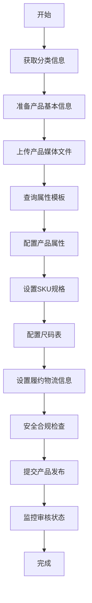
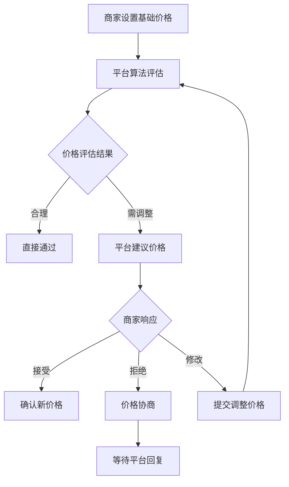

# Temu Product Listing Instructions
## 产品发布指导文档

**文档版本**: v1.0  
**最后更新**: 2025年9月22日  
**适用范围**: Temu合作伙伴平台开发者  

---

## 📋 目录

1. [产品发布流程概述](#1-产品发布流程概述)
2. [API接口详细说明和调用方法](#2-api接口详细说明和调用方法)
3. [必填字段和可选字段的完整列表及要求](#3-必填字段和可选字段的完整列表及要求)
4. [产品信息格式规范和验证规则](#4-产品信息格式规范和验证规则)
5. [图片上传要求和规格](#5-图片上传要求和规格)
6. [分类和属性设置指导](#6-分类和属性设置指导)
7. [价格和库存管理说明](#7-价格和库存管理说明)
8. [错误代码和处理方案](#8-错误代码和处理方案)
9. [最佳实践建议](#9-最佳实践建议)
10. [完整的代码示例和调用演示](#10-完整的代码示例和调用演示)
11. [常见问题解答](#11-常见问题解答)

---

## 1. 产品发布流程概述

### 1.1 整体流程图



### 1.2 核心发布步骤

| 步骤 | 描述 | 关键API | 必需性 |
|------|------|---------|--------|
| 1 | 分类查询 | `bg.local.goods.cats.get` | ✅ 必需 |
| 2 | 产品信息准备 | - | ✅ 必需 |
| 3 | 媒体文件上传 | `bg.local.goods.gallery.signature.get` | ✅ 必需 |
| 4 | 属性模板查询 | `bg.local.goods.template.get` | ✅ 必需 |
| 5 | 属性合规检查 | `bg.local.goods.property.compliance.check` | ✅ 必需 |
| 6 | SKU规格配置 | `bg.local.goods.spec.id.get` | ✅ 必需 |
| 7 | 尺码表设置 | `bg.local.goods.size.element.get` | ⚠️ 条件性 |
| 8 | 履约信息配置 | `bg.local.freight.template.query.list` | ✅ 必需 |
| 9 | 安全合规 | `bg.local.goods.compliance.extra.template.get` | ✅ 必需 |
| 10 | 产品发布 | `bg.local.goods.add` | ✅ 必需 |
| 11 | 状态监控 | `bg.local.goods.publish.status.get` | ✅ 必需 |

### 1.3 时间估算

- **简单产品**: 30-60分钟
- **复杂产品**: 1-2小时
- **服装类产品**: 2-3小时（包含尺码表配置）

---

## 2. API接口详细说明和调用方法

### 2.1 授权认证接口

#### 2.1.1 创建访问令牌
```http
POST /api/bg.open.accesstoken.create
```

**请求参数:**
```json
{
  "app_key": "your_app_key",
  "app_secret": "your_app_secret",
  "grant_type": "client_credentials"
}
```

**响应示例:**
```json
{
  "access_token": "eyJhbGciOiJIUzI1NiIsInR5cCI6IkpXVCJ9...",
  "expires_in": 3600,
  "token_type": "Bearer"
}
```

#### 2.1.2 获取访问令牌信息
```http
GET /api/bg.open.accesstoken.info.get
```

### 2.2 核心产品管理接口

#### 2.2.1 分类查询接口

**接口名称**: `bg.local.goods.cats.get`  
**功能**: 获取产品标准分类信息  

**请求参数:**
```json
{
  "parentCatId": 0,  // 0表示获取一级分类
  "access_token": "your_access_token"
}
```

**响应示例:**
```json
{
  "goodsCatsList": [
    {
      "catId": 32266,
      "catName": "Pants",
      "catType": 0,        // 0=服装, 1=非服装
      "leaf": true,        // 是否叶子分类
      "level": 6,
      "parentId": 32263,
      "expandCatType": 0   // 特殊分类标识
    }
  ]
}
```

**调用逻辑:**
1. 首次调用传入 `parentCatId=0` 获取一级分类
2. 选择目标分类，将其 `catId` 作为下次调用的 `parentCatId`
3. 重复步骤2，直到 `leaf=true` 获得叶子分类
4. 使用叶子分类的 `catId` 进行产品发布

#### 2.2.2 产品属性模板查询接口

**接口名称**: `bg.local.goods.template.get`  
**功能**: 获取指定分类的属性模板  

**请求参数:**
```json
{
  "catId": 32266,
  "access_token": "your_access_token"
}
```

#### 2.2.3 产品添加接口

**接口名称**: `bg.local.goods.add`  
**功能**: 提交产品信息进行发布  

**请求参数结构:**
```json
{
  "goodsBasic": { /* 基本产品信息 */ },
  "goodsServicePromise": { /* 服务承诺信息 */ },
  "goodsProperty": [ /* 产品属性数组 */ ],
  "bulletPoints": [ /* 产品要点 */ ],
  "goodsDesc": "产品描述",
  "certificationInfo": { /* 认证信息 */ },
  "goodsSizeChartList": [ /* 尺码表 */ ],
  "skuList": [ /* SKU列表 */ ]
}
```

### 2.3 媒体文件处理接口

#### 2.3.1 获取上传签名
**接口名称**: `bg.local.goods.gallery.signature.get`

#### 2.3.2 图片材料处理
**接口名称**: `bg.local.goods.image.upload`

### 2.4 规格和库存管理接口

#### 2.4.1 生成规格ID
**接口名称**: `bg.local.goods.spec.id.get`

#### 2.4.2 库存编辑
**接口名称**: `bg.local.goods.stock.edit`

### 2.5 合规性检查接口

#### 2.5.1 属性合规验证
**接口名称**: `bg.local.goods.property.compliance.check`

#### 2.5.2 违规词汇检查
**接口名称**: `temu.local.goods.illegal.vocabulary.check`

### 2.6 价格管理接口

| 接口名称 | 功能描述 |
|----------|----------|
| `bg.local.goods.priceorder.query` | 查询待处理价格任务 |
| `bg.local.goods.priceorder.accept` | 确认平台建议价格 |
| `bg.local.goods.priceorder.reject` | 拒绝价格建议 |
| `bg.local.goods.priceorder.negotiate` | 价格协商 |
| `bg.local.goods.priceorder.change.sku.price` | 修改SKU价格 |
| `bg.local.goods.sku.list.price.query` | 获取当前基础价格 |

---

## 3. 必填字段和可选字段的完整列表及要求

### 3.1 产品基本信息字段（goodsBasic）

| 字段名 | 类型 | 必填 | 长度限制 | 验证规则 |
|--------|------|------|----------|----------|
| `goodsName` | String | ✅ | ≤500字符 | 仅支持英文、数字和常见符号 |
| `goodsDesc` | String | ✅ | ≤2000字符 | 仅支持英文、数字和常见符号 |
| `catId` | Integer | ✅ | - | 必须为叶子分类ID |
| `outGoodsSn` | String | ✅ | ≤100字符 | 商家商品编号，唯一标识 |
| `originRegion1` | String | ✅ | - | 原产地国家或地区 |
| `originRegion2` | String | ⚠️ | - | 原产地省或州（条件必填） |
| `agreeDefaultOriginRegion` | Boolean | ❌ | - | 是否同意平台默认原产地 |

### 3.2 产品要点字段（bulletPoints）

| 字段名 | 类型 | 必填 | 限制 | 验证规则 |
|--------|------|------|------|----------|
| `bulletPoints` | Array | ❌ | 最多5个 | 每个要点≤200字符，仅英文数字符号 |

### 3.3 服务承诺字段（goodsServicePromise）

| 字段名 | 类型 | 必填 | 说明 |
|--------|------|------|------|
| `prepareTime` | Integer | ✅ | 备货时间：0/1/2天 |
| `costTemplateId` | Integer | ✅ | 运输模板ID |
| `importDesignation` | String | ✅ | 进口标识，固定值之一 |
| `fulfillmentType` | Integer | ✅ | 履约类型：1=自配送 |

**importDesignation允许值:**
- "Imported"
- "Made in the USA"
- "Made in the USA and Imported"
- "Made in the USA or Imported"

### 3.4 SKU字段（skuList）

| 字段名 | 类型 | 必填 | 验证规则 |
|--------|------|------|----------|
| `outSkuSn` | String | ✅ | ≤100字符，商家SKU编号 |
| `specIdList` | Array | ✅ | 1-2个规格ID |
| `skuPreviewGallery` | Array | ✅ | 3-10张预览图 |
| `listPrice` | String | ✅ | 基础价格 > 0 |
| `salePrice` | String | ✅ | 售价 > 基础价格 |
| `weight` | String | ✅ | 重量（整数≤4位，小数≤1位） |
| `length` | String | ✅ | 长度（整数≤3位，小数≤1位） |
| `width` | String | ✅ | 宽度（整数≤3位，小数≤1位） |
| `height` | String | ✅ | 高度（整数≤3位，小数≤1位） |

### 3.5 产品属性字段（goodsProperty）

| 字段名 | 类型 | 必填 | 说明 |
|--------|------|------|------|
| `templatePid` | Integer | ✅ | 模板属性ID |
| `refPid` | Integer | ✅ | 引用属性ID |
| `pid` | Integer | ✅ | 属性ID |
| `vid` | Integer | ⚠️ | 属性值ID（选择类型必填） |
| `value` | String | ⚠️ | 属性值（输入类型必填） |
| `valueUnitId` | Integer | ❌ | 单位ID |
| `valueUnit` | String | ❌ | 单位名称 |

### 3.6 尺码表字段（goodsSizeChartList）

| 字段名 | 类型 | 必填 | 说明 |
|--------|------|------|------|
| `sizeChartType` | Integer | ✅ | 尺码表类型 |
| `sizeChartImg` | String | ✅ | 尺码表图片URL |
| `sizeElementList` | Array | ✅ | 尺寸元素列表 |

### 3.7 认证信息字段（certificationInfo）

| 字段名 | 类型 | 必填 | 说明 |
|--------|------|------|------|
| `compliancePropertyList` | Array | ⚠️ | 合规属性列表 |
| `qualificationFileList` | Array | ⚠️ | 资质文件列表 |
| `realShotImgList` | Array | ⚠️ | 实拍图列表 |

---

## 4. 产品信息格式规范和验证规则

### 4.1 文本内容验证规则

#### 4.1.1 字符集规范
- **允许字符**: 英文字母(a-z, A-Z)、数字(0-9)、常见符号
- **禁止字符**: 中文、日文、韩文等非拉丁字符
- **特殊符号**: `!@#$%^&*()_+-=[]{}|;:'"<>?,.`

#### 4.1.2 长度限制验证
```javascript
// 验证函数示例
function validateTextLength(text, maxLength, fieldName) {
  if (!text) return { valid: false, error: `${fieldName} is required` };
  if (text.length > maxLength) {
    return { 
      valid: false, 
      error: `${fieldName} exceeds maximum length of ${maxLength} characters` 
    };
  }
  return { valid: true };
}

// 使用示例
const nameValidation = validateTextLength(goodsName, 500, 'Product Name');
const descValidation = validateTextLength(goodsDesc, 2000, 'Product Description');
```

#### 4.1.3 内容合规检查
```javascript
// 违规词汇检查
async function checkIllegalVocabulary(content) {
  const response = await api.call('temu.local.goods.illegal.vocabulary.check', {
    content: content
  });
  return response.isCompliant;
}
```

### 4.2 数值字段验证规则

#### 4.2.1 价格验证
```javascript
function validatePrice(listPrice, salePrice) {
  const list = parseFloat(listPrice);
  const sale = parseFloat(salePrice);
  
  if (list <= 0) return { valid: false, error: 'List price must be greater than 0' };
  if (sale <= list) return { valid: false, error: 'Sale price must be greater than list price' };
  
  return { valid: true };
}
```

#### 4.2.2 尺寸重量验证
```javascript
function validateDimensions(weight, length, width, height) {
  const rules = {
    weight: { integerDigits: 4, decimalDigits: 1 },
    dimensions: { integerDigits: 3, decimalDigits: 1 }
  };
  
  const validateMeasurement = (value, rule) => {
    const [integer, decimal] = value.split('.');
    if (integer.length > rule.integerDigits) return false;
    if (decimal && decimal.length > rule.decimalDigits) return false;
    return true;
  };
  
  return {
    weight: validateMeasurement(weight, rules.weight),
    length: validateMeasurement(length, rules.dimensions),
    width: validateMeasurement(width, rules.dimensions),
    height: validateMeasurement(height, rules.dimensions)
  };
}
```

### 4.3 SKU验证规则

#### 4.3.1 基础SKU验证
```javascript
function validateSKUs(skuList) {
  const errors = [];
  
  // 检查SKU数量
  if (skuList.length === 0) {
    errors.push('At least one SKU is required');
  }
  if (skuList.length > 500) {
    errors.push('Maximum 500 SKUs allowed');
  }
  
  skuList.forEach((sku, index) => {
    // 检查必填字段
    if (!sku.outSkuSn) errors.push(`SKU ${index}: outSkuSn is required`);
    if (!sku.skuPreviewGallery || sku.skuPreviewGallery.length < 3) {
      errors.push(`SKU ${index}: At least 3 preview images required`);
    }
    
    // 检查价格
    const priceValidation = validatePrice(sku.listPrice, sku.salePrice);
    if (!priceValidation.valid) {
      errors.push(`SKU ${index}: ${priceValidation.error}`);
    }
  });
  
  return { valid: errors.length === 0, errors };
}
```

#### 4.3.2 规格一致性验证
```javascript
function validateSpecConsistency(skuList, goodsProperties) {
  const specIds = goodsProperties
    .filter(prop => prop.isSale)
    .map(prop => prop.pid);
  
  return skuList.every(sku => 
    sku.specIdList.every(id => specIds.includes(id))
  );
}
```

### 4.4 属性验证规则

#### 4.4.1 属性类型验证
```javascript
function validatePropertyByControlType(property, controlType) {
  switch(controlType) {
    case 0: // INPUT
      return property.value && property.value.trim().length > 0;
    
    case 1: // CHOOSE
      return property.vid && property.vid > 0;
    
    case 16: // PROPERTY_CHOOSE_AND_INPUT
      return property.numberInputValue && 
             property.valueUnitId && 
             property.valueUnit;
    
    default:
      return true;
  }
}
```

#### 4.4.2 必填属性检查
```javascript
async function validateRequiredProperties(goodsProperties, catId) {
  const template = await api.call('bg.local.goods.template.get', { catId });
  const requiredProps = template.properties.filter(p => p.required);
  
  const providedPids = goodsProperties.map(p => p.pid);
  const missingProps = requiredProps.filter(p => !providedPids.includes(p.pid));
  
  return {
    valid: missingProps.length === 0,
    missing: missingProps.map(p => p.propertyName)
  };
}
```

---

## 5. 图片上传要求和规格

### 5.1 图片规格总览表

| 图片类型 | 数量要求 | 尺寸要求 | 宽高比 | 分辨率 | 文件大小 | 格式 |
|----------|----------|----------|--------|--------|----------|------|
| 服装轮播图 | 3-10张 | 宽≥1340px, 高≥1785px | 3:4 | 高清 | ≤3MB | JPEG/JPG/PNG |
| 非服装轮播图 | 3-10张 | 宽≥800px, 高≥800px | 1:1 | 高清 | ≤3MB | JPEG/JPG/PNG |
| 产品详情图 | ≤50张 | 宽≥480px, 高≥480px | ≥1:3 | 高清 | ≤3MB | JPEG/JPG/PNG |
| 尺码表图片 | 1张 | 宽≥800px, 高≥800px | ≥1:3 | 高清 | ≤3MB | JPEG/JPG/PNG |
| 产品视频 | ≤1个 | 分辨率≥720P | 1:1/4:3/16:9 | ≥720P | ≤100MB | MP4/AVI/MOV等 |
| 详情视频 | ≤1个 | 分辨率≥720P | 1:1/4:3/16:9 | ≥720P | ≤300MB | MP4/AVI/MOV等 |

### 5.2 图片上传流程

#### 5.2.1 获取上传签名
```javascript
async function getUploadSignature() {
  const response = await api.call('bg.local.goods.gallery.signature.get', {
    access_token: 'your_access_token'
  });
  return response.signature;
}
```

#### 5.2.2 上传图片文件
```javascript
async function uploadImage(file, signature) {
  const formData = new FormData();
  formData.append('file', file);
  formData.append('signature', signature);
  
  const response = await fetch('/api/upload', {
    method: 'POST',
    body: formData
  });
  
  return response.json();
}
```

### 5.3 图片质量要求

#### 5.3.1 服装类产品图片要求
- **主图要求**: 
  - 纯白色背景
  - 产品占图片70-80%
  - 无水印、无文字
  - 展示产品正面
  
- **细节图要求**:
  - 展示产品质感和工艺
  - 包含标签、尺码信息
  - 多角度展示
  
- **模特图要求**:
  - 真人模特穿着展示
  - 背景简洁
  - 光线充足自然

#### 5.3.2 非服装类产品图片要求
- **主图要求**:
  - 纯白色或浅色背景
  - 产品居中显示
  - 45度角展示（适用时）
  
- **功能图要求**:
  - 展示产品使用场景
  - 突出功能特点
  - 包含尺寸参考

### 5.4 图片优化建议

#### 5.4.1 图片压缩
```javascript
function compressImage(file, maxSize = 3 * 1024 * 1024) { // 3MB
  return new Promise((resolve) => {
    const canvas = document.createElement('canvas');
    const ctx = canvas.getContext('2d');
    const img = new Image();
    
    img.onload = () => {
      canvas.width = img.width;
      canvas.height = img.height;
      ctx.drawImage(img, 0, 0);
      
      let quality = 1.0;
      let compressedFile;
      
      do {
        canvas.toBlob((blob) => {
          compressedFile = blob;
        }, 'image/jpeg', quality);
        quality -= 0.1;
      } while (compressedFile.size > maxSize && quality > 0.1);
      
      resolve(compressedFile);
    };
    
    img.src = URL.createObjectURL(file);
  });
}
```

#### 5.4.2 图片验证
```javascript
function validateImage(file, requirements) {
  return new Promise((resolve) => {
    const img = new Image();
    img.onload = () => {
      const validation = {
        size: file.size <= requirements.maxSize,
        width: img.width >= requirements.minWidth,
        height: img.height >= requirements.minHeight,
        ratio: checkAspectRatio(img.width, img.height, requirements.aspectRatio),
        format: requirements.formats.includes(file.type)
      };
      
      resolve({
        valid: Object.values(validation).every(v => v),
        checks: validation
      });
    };
    img.src = URL.createObjectURL(file);
  });
}

function checkAspectRatio(width, height, targetRatio) {
  const ratio = width / height;
  const [targetW, targetH] = targetRatio.split(':').map(Number);
  const target = targetW / targetH;
  return Math.abs(ratio - target) < 0.1; // 允许10%误差
}
```

### 5.5 视频上传规范

#### 5.5.1 视频格式要求
- **支持格式**: MP4, AVI, MOV, WMV, FLV, MKV, M4V等
- **编码标准**: H.264/AVC (推荐)
- **音频编码**: AAC (推荐)

#### 5.5.2 视频质量参数
```javascript
const videoRequirements = {
  productVideo: {
    maxDuration: 60, // 秒
    maxSize: 100 * 1024 * 1024, // 100MB
    minResolution: '1280x720',
    aspectRatios: ['1:1', '4:3', '16:9']
  },
  detailVideo: {
    maxDuration: 180, // 秒
    maxSize: 300 * 1024 * 1024, // 300MB
    minResolution: '1280x720',
    aspectRatios: ['1:1', '4:3', '16:9']
  }
};
```

---

## 6. 分类和属性设置指导

### 6.1 分类体系理解

#### 6.1.1 分类层级结构
```
一级分类 (Level 1)
├── 二级分类 (Level 2)
│   ├── 三级分类 (Level 3)
│   │   ├── 四级分类 (Level 4)
│   │   │   ├── 五级分类 (Level 5)
│   │   │   │   └── 叶子分类 (Leaf Category)
```

#### 6.1.2 分类类型说明
| catType | 说明 | 图片要求 | 特殊处理 |
|---------|------|----------|----------|
| 0 | 服装类 | 3:4宽高比 | 需要尺码表 |
| 1 | 非服装类 | 1:1宽高比 | 标准处理 |

#### 6.1.3 特殊分类标识（expandCatType）
| expandCatType | 分类类型 | 特殊要求 |
|---------------|----------|----------|
| 1 | DVD/CD分类 | 需制造商信息，中国大陆需ISBN代码 |
| 2 | 图书分类 | 需发布商信息 |
| 0 | 普通分类 | 标准处理流程 |

### 6.2 属性体系详解

#### 6.2.1 属性分类
```javascript
// 属性类型判断
function classifyProperty(property) {
  return {
    isSaleProperty: property.isSale === true,      // 销售属性
    isNormalProperty: property.isSale === false,   // 普通属性
    isRequired: property.required === true,        // 必填属性
    isOptional: property.required === false        // 可选属性
  };
}
```

#### 6.2.2 控制类型详解

| ControlType | 名称 | 输入方式 | 数据结构 |
|-------------|------|----------|----------|
| 0 | INPUT | 文本输入 | `{pid, vid: 0, value: "text"}` |
| 1 | CHOOSE | 单选 | `{pid, vid: number, value: "selected"}` |
| 3 | INPUT_CHOOSE | 输入+选择 | `{pid, vid: number, value: "text"}` |
| 5 | SINGLE_YMD_DATE | 年月日选择 | `{pid, vid: 0, value: "YYYY-MM-DD"}` |
| 6 | MULTIPLE_YMD_DATE | 日期范围 | `{pid, vid: 0, value: "YYYY-MM-DD,YYYY-MM-DD"}` |
| 16 | PROPERTY_CHOOSE_AND_INPUT | 数值+单位 | `{pid, numberInputValue, valueUnitId, valueUnit}` |

#### 6.2.3 销售属性配置

**预定义销售属性**:
```javascript
async function getPredefinedSaleProperties(catId) {
  const template = await api.call('bg.local.goods.template.get', { catId });
  return template.properties.filter(p => 
    p.isSale && p.inputMaxSpecNum === 0
  );
}
```

**自定义销售属性**:
```javascript
async function createCustomSaleProperty(parentSpecId, specName, specValues) {
  if (inputMaxSpecNum <= 0) {
    throw new Error('Custom properties not allowed for this category');
  }
  
  const specIds = [];
  for (const value of specValues) {
    const response = await api.call('bg.local.goods.spec.id.get', {
      parentSpecId: parentSpecId,
      specName: specName,
      specValue: value
    });
    specIds.push(response.specId);
  }
  
  return specIds;
}
```

### 6.3 属性配置实践

#### 6.3.1 属性模板解析
```javascript
async function parsePropertyTemplate(catId) {
  const template = await api.call('bg.local.goods.template.get', { catId });
  
  const categorizedProperties = {
    required: [],
    optional: [],
    saleProperties: [],
    normalProperties: []
  };
  
  template.properties.forEach(property => {
    if (property.required) categorizedProperties.required.push(property);
    else categorizedProperties.optional.push(property);
    
    if (property.isSale) categorizedProperties.saleProperties.push(property);
    else categorizedProperties.normalProperties.push(property);
  });
  
  return categorizedProperties;
}
```

#### 6.3.2 父子属性处理
```javascript
function handleParentChildProperties(properties) {
  const parentProperties = properties.filter(p => p.showType === 0);
  const childProperties = properties.filter(p => p.showType === 1);
  
  return parentProperties.map(parent => ({
    ...parent,
    children: childProperties.filter(child => 
      child.dependentPid === parent.pid
    )
  }));
}
```

#### 6.3.3 属性值生成
```javascript
function generatePropertyValue(property, userInput) {
  const baseProperty = {
    templatePid: property.templatePid,
    refPid: property.refPid,
    pid: property.pid
  };
  
  switch(property.controlType) {
    case 0: // INPUT
      return {
        ...baseProperty,
        vid: 0,
        value: userInput.textValue
      };
      
    case 1: // CHOOSE
      const selectedOption = property.values.find(v => v.vid === userInput.selectedVid);
      return {
        ...baseProperty,
        vid: selectedOption.vid,
        value: selectedOption.value
      };
      
    case 16: // PROPERTY_CHOOSE_AND_INPUT
      return {
        ...baseProperty,
        numberInputValue: userInput.numberValue,
        valueUnitId: userInput.unitId,
        valueUnit: userInput.unitName
      };
      
    default:
      return baseProperty;
  }
}
```

### 6.4 分类选择最佳实践

#### 6.4.1 分类选择助手
```javascript
class CategorySelector {
  constructor() {
    this.selectedPath = [];
  }
  
  async selectCategory(parentId = 0) {
    const categories = await api.call('bg.local.goods.cats.get', {
      parentCatId: parentId
    });
    
    return categories.goodsCatsList;
  }
  
  async navigateToLeaf(categoryId) {
    const categories = await this.selectCategory(categoryId);
    
    if (categories.length === 0) {
      // 已经是叶子分类
      return categoryId;
    }
    
    // 继续导航到下一级
    // 这里需要用户选择或自动选择逻辑
    console.log('Available subcategories:', categories);
    return null; // 需要进一步选择
  }
  
  validateLeafCategory(categoryId) {
    return this.selectCategory(categoryId)
      .then(cats => cats.length === 0);
  }
}
```

---

## 7. 价格和库存管理说明

### 7.1 价格管理体系概述

Temu平台采用动态价格管理模式，包含基础价格、建议价格和最终售价三个层次。

#### 7.1.1 价格管理模式


#### 7.1.2 价格状态说明

| 状态码 | 状态名称 | 描述 | 商家可操作 |
|--------|----------|------|------------|
| 100 | 审核中 | 价格正在平台审核 | 等待 |
| 101 | 等待商家确认 | 平台已给出建议价格 | 接受/拒绝/协商 |
| 201 | 通过 | 价格审核通过 | 无 |
| 202 | 拒绝待修改 | 需要商家修改价格 | 修改重新提交 |
| 203 | 商家确认 | 商家已确认建议价格 | 无 |
| 204 | 商家发起修改 | 商家提交了新的价格 | 等待审核 |
| 205 | 商家拒绝 | 商家拒绝了建议价格 | 协商 |
| 206 | 拒绝 | 平台最终拒绝价格 | 重新调整 |

### 7.2 价格管理API详解

#### 7.2.1 查询价格任务
```javascript
async function queryPriceTasks() {
  const response = await api.call('bg.local.goods.priceorder.query', {
    status: [101], // 查询等待确认的价格任务
    pageSize: 20,
    pageNo: 1
  });
  
  return response.priceOrders.map(order => ({
    goodsId: order.goodsId,
    goodsName: order.goodsName,
    currentPrice: order.currentPrice,
    suggestedPrice: order.suggestedPrice,
    reason: order.adjustmentReason,
    deadline: order.deadline
  }));
}
```

#### 7.2.2 接受建议价格
```javascript
async function acceptSuggestedPrice(priceOrderId) {
  try {
    const response = await api.call('bg.local.goods.priceorder.accept', {
      priceOrderId: priceOrderId,
      acceptAll: false // 单个确认
    });
    
    return {
      success: true,
      message: 'Price accepted successfully',
      newPrice: response.finalPrice
    };
  } catch (error) {
    return {
      success: false,
      error: error.message
    };
  }
}
```

#### 7.2.3 价格协商
```javascript
async function negotiatePrice(priceOrderId, proposedPrice, reason) {
  const response = await api.call('bg.local.goods.priceorder.negotiate', {
    priceOrderId: priceOrderId,
    proposedPrice: proposedPrice,
    negotiationReason: reason
  });
  
  return response;
}
```

#### 7.2.4 修改SKU价格
```javascript
async function changeSKUPrice(goodsId, skuPriceList) {
  const response = await api.call('bg.local.goods.priceorder.change.sku.price', {
    goodsId: goodsId,
    skuPriceList: skuPriceList.map(sku => ({
      skuId: sku.skuId,
      listPrice: sku.newListPrice,
      salePrice: sku.newSalePrice,
      changeReason: sku.reason
    }))
  });
  
  return response;
}
```

### 7.3 库存管理

#### 7.3.1 库存编辑API
```javascript
async function updateStock(skuId, quantity, operation = 'set') {
  const response = await api.call('bg.local.goods.stock.edit', {
    skuId: skuId,
    stockQuantity: quantity,
    operationType: operation, // 'set', 'add', 'subtract'
    reason: 'Inventory update'
  });
  
  return response;
}
```

#### 7.3.2 批量库存更新
```javascript
async function batchUpdateStock(stockUpdates) {
  const promises = stockUpdates.map(update => 
    updateStock(update.skuId, update.quantity, update.operation)
  );
  
  try {
    const results = await Promise.allSettled(promises);
    return results.map((result, index) => ({
      skuId: stockUpdates[index].skuId,
      success: result.status === 'fulfilled',
      error: result.reason?.message
    }));
  } catch (error) {
    console.error('Batch stock update failed:', error);
    throw error;
  }
}
```

### 7.4 价格策略最佳实践

#### 7.4.1 竞争性定价策略
```javascript
class PricingStrategy {
  constructor(competitorPrices, costPrice, targetMargin) {
    this.competitorPrices = competitorPrices;
    this.costPrice = costPrice;
    this.targetMargin = targetMargin;
  }
  
  calculateOptimalPrice() {
    const minCompetitorPrice = Math.min(...this.competitorPrices);
    const targetPrice = this.costPrice * (1 + this.targetMargin);
    
    // 价格策略：不超过最低竞争对手价格，但要保证利润
    return Math.max(
      Math.min(targetPrice, minCompetitorPrice * 0.95),
      this.costPrice * 1.1 // 最小10%利润
    );
  }
  
  generatePriceRange() {
    const basePrice = this.calculateOptimalPrice();
    return {
      listPrice: basePrice * 1.2,  // 20%折扣空间
      salePrice: basePrice
    };
  }
}
```

#### 7.4.2 动态价格调整
```javascript
async function dynamicPriceAdjustment() {
  const pendingTasks = await queryPriceTasks();
  
  for (const task of pendingTasks) {
    const decision = await evaluatePriceDecision(task);
    
    switch(decision.action) {
      case 'accept':
        await acceptSuggestedPrice(task.priceOrderId);
        break;
        
      case 'negotiate':
        await negotiatePrice(
          task.priceOrderId, 
          decision.proposedPrice, 
          decision.reason
        );
        break;
        
      case 'reject':
        // 实现拒绝逻辑
        break;
    }
  }
}

async function evaluatePriceDecision(task) {
  const profitMargin = (task.suggestedPrice - task.costPrice) / task.costPrice;
  
  if (profitMargin >= 0.15) { // 15%以上利润率
    return { action: 'accept' };
  } else if (profitMargin >= 0.1) { // 10%-15%之间协商
    return {
      action: 'negotiate',
      proposedPrice: task.costPrice * 1.15,
      reason: 'Maintain minimum profit margin'
    };
  } else {
    return { action: 'reject' };
  }
}
```

### 7.5 库存预警系统

#### 7.5.1 库存监控
```javascript
class InventoryMonitor {
  constructor(lowStockThreshold = 10, outOfStockThreshold = 0) {
    this.lowStockThreshold = lowStockThreshold;
    this.outOfStockThreshold = outOfStockThreshold;
  }
  
  async checkInventoryLevels() {
    const products = await api.call('temu.local.sku.list.retrieve', {
      status: 'active'
    });
    
    const alerts = [];
    
    products.forEach(product => {
      product.skuList.forEach(sku => {
        if (sku.stock <= this.outOfStockThreshold) {
          alerts.push({
            type: 'OUT_OF_STOCK',
            skuId: sku.skuId,
            productName: product.goodsName,
            currentStock: sku.stock
          });
        } else if (sku.stock <= this.lowStockThreshold) {
          alerts.push({
            type: 'LOW_STOCK',
            skuId: sku.skuId,
            productName: product.goodsName,
            currentStock: sku.stock
          });
        }
      });
    });
    
    return alerts;
  }
  
  async autoReplenishStock(skuId, replenishQuantity) {
    return await updateStock(skuId, replenishQuantity, 'add');
  }
}
```

---

## 8. 错误代码和处理方案

### 8.1 错误分类体系

#### 8.1.1 系统级错误
| 错误类型 | 错误码范围 | 描述 | 处理策略 |
|----------|------------|------|----------|
| 网络错误 | 1000-1999 | 网络连接、超时等 | 重试机制 |
| 认证错误 | 2000-2999 | 访问令牌、权限等 | 重新认证 |
| 系统错误 | 3000-3999 | 服务器内部错误 | 联系技术支持 |

#### 8.1.2 业务级错误
| 错误类型 | 错误码范围 | 描述 | 处理策略 |
|----------|------------|------|----------|
| 参数错误 | 4000-4999 | 请求参数格式、值错误 | 参数校验修复 |
| 数据错误 | 5000-5999 | 数据完整性、一致性错误 | 数据修正 |
| 业务规则错误 | 6000-6999 | 违反平台业务规则 | 规则调整 |

### 8.2 常见错误详解

#### 8.2.1 Invalid Request Parameters
**错误场景**: 
- importDesignation值不正确
- 字段类型错误
- 必填参数缺失

**解决方案**:
```javascript
function validateImportDesignation(value) {
  const allowedValues = [
    "Imported",
    "Made in the USA", 
    "Made in the USA and Imported",
    "Made in the USA or Imported"
  ];
  
  return allowedValues.includes(value);
}

function validateFieldTypes(data) {
  const typeChecks = {
    weight: (val) => typeof val === 'string',
    length: (val) => typeof val === 'string',
    width: (val) => typeof val === 'string',
    height: (val) => typeof val === 'string',
    listPrice: (val) => typeof val === 'string',
    salePrice: (val) => typeof val === 'string'
  };
  
  const errors = [];
  Object.entries(typeChecks).forEach(([field, checker]) => {
    if (data[field] && !checker(data[field])) {
      errors.push(`${field} should be string type`);
    }
  });
  
  return errors;
}
```

#### 8.2.2 System Error, Please Try Again Later
**错误场景**: 
- 服务器临时不可用
- 系统维护
- 高并发限制

**解决方案**:
```javascript
class RetryHandler {
  constructor(maxRetries = 3, baseDelay = 1000) {
    this.maxRetries = maxRetries;
    this.baseDelay = baseDelay;
  }
  
  async executeWithRetry(apiCall) {
    let lastError;
    
    for (let attempt = 0; attempt <= this.maxRetries; attempt++) {
      try {
        return await apiCall();
      } catch (error) {
        lastError = error;
        
        if (attempt < this.maxRetries) {
          const delay = this.baseDelay * Math.pow(2, attempt); // 指数退避
          await new Promise(resolve => setTimeout(resolve, delay));
        }
      }
    }
    
    throw new Error(`Failed after ${this.maxRetries + 1} attempts: ${lastError.message}`);
  }
}
```

#### 8.2.3 Field Length Exceeded
**错误场景**: 
- outSkuSn或outGoodsSn超过100字符
- goodsName超过500字符
- goodsDesc超过2000字符

**解决方案**:
```javascript
function truncateFields(data) {
  const fieldLimits = {
    outSkuSn: 100,
    outGoodsSn: 100,
    goodsName: 500,
    goodsDesc: 2000,
    bulletPoints: 200 // 每个要点
  };
  
  Object.entries(fieldLimits).forEach(([field, limit]) => {
    if (data[field] && data[field].length > limit) {
      console.warn(`${field} truncated from ${data[field].length} to ${limit} characters`);
      data[field] = data[field].substring(0, limit);
    }
  });
  
  // 处理bulletPoints数组
  if (data.bulletPoints && Array.isArray(data.bulletPoints)) {
    data.bulletPoints = data.bulletPoints
      .slice(0, 5) // 最多5个
      .map(point => point.substring(0, 200)); // 每个最多200字符
  }
  
  return data;
}
```

#### 8.2.4 Missing Trademark Information
**错误场景**: 
- 产品包含品牌属性但缺少商标信息
- 商标文件无效或过期

**解决方案**:
```javascript
async function validateTrademarkRequirement(goodsProperties) {
  const brandProperty = goodsProperties.find(p => 
    p.propertyName && p.propertyName.toLowerCase().includes('brand')
  );
  
  if (brandProperty && brandProperty.value) {
    // 检查是否需要商标信息
    const trademarkInfo = await api.call('bg.local.goods.brand.trademark.get', {
      brandName: brandProperty.value
    });
    
    if (trademarkInfo.required && !trademarkInfo.available) {
      throw new Error(`Trademark information required for brand: ${brandProperty.value}`);
    }
  }
}
```

#### 8.2.5 Image/Video Validation Errors
**错误场景**: 
- 图片尺寸不符合要求
- 图片数量不足
- 文件格式不支持

**解决方案**:
```javascript
async function validateMediaFiles(files, catType) {
  const requirements = catType === 0 ? 
    { width: 1340, height: 1785, ratio: 3/4, count: [3, 10] } : // 服装
    { width: 800, height: 800, ratio: 1, count: [3, 10] };     // 非服装
  
  const errors = [];
  
  if (files.length < requirements.count[0]) {
    errors.push(`Minimum ${requirements.count[0]} images required`);
  }
  
  for (const file of files) {
    const validation = await validateImage(file, requirements);
    if (!validation.valid) {
      errors.push(`${file.name}: ${Object.entries(validation.checks)
        .filter(([_, valid]) => !valid)
        .map(([check]) => check).join(', ')}`);
    }
  }
  
  return { valid: errors.length === 0, errors };
}
```

### 8.3 错误处理框架

#### 8.3.1 统一错误处理器
```javascript
class TemuErrorHandler {
  constructor() {
    this.errorHandlers = new Map();
    this.setupDefaultHandlers();
  }
  
  setupDefaultHandlers() {
    // 参数错误处理器
    this.errorHandlers.set('INVALID_PARAMETERS', async (error, context) => {
      const fixedData = await this.autoFixParameters(context.data);
      return { action: 'retry', data: fixedData };
    });
    
    // 系统错误处理器
    this.errorHandlers.set('SYSTEM_ERROR', async (error, context) => {
      return { action: 'retry', delay: 5000 };
    });
    
    // 图片错误处理器
    this.errorHandlers.set('IMAGE_ERROR', async (error, context) => {
      const fixedImages = await this.autoFixImages(context.images);
      return { action: 'retry', data: { ...context.data, images: fixedImages } };
    });
  }
  
  async handleError(error, context) {
    const errorType = this.classifyError(error);
    const handler = this.errorHandlers.get(errorType);
    
    if (handler) {
      return await handler(error, context);
    }
    
    return { action: 'fail', error: error.message };
  }
  
  classifyError(error) {
    if (error.message.includes('Invalid Request Parameters')) {
      return 'INVALID_PARAMETERS';
    }
    if (error.message.includes('System error')) {
      return 'SYSTEM_ERROR';
    }
    if (error.message.includes('image') || error.message.includes('video')) {
      return 'IMAGE_ERROR';
    }
    return 'UNKNOWN_ERROR';
  }
  
  async autoFixParameters(data) {
    // 自动修复参数
    const fixed = { ...data };
    
    // 修复importDesignation
    if (fixed.importDesignation && !validateImportDesignation(fixed.importDesignation)) {
      fixed.importDesignation = "Imported"; // 默认值
    }
    
    // 修复字符串长度
    fixed = truncateFields(fixed);
    
    // 修复字段类型
    ['weight', 'length', 'width', 'height', 'listPrice', 'salePrice'].forEach(field => {
      if (fixed[field] && typeof fixed[field] !== 'string') {
        fixed[field] = String(fixed[field]);
      }
    });
    
    return fixed;
  }
}
```

#### 8.3.2 智能重试机制
```javascript
class IntelligentRetry {
  constructor() {
    this.retryStrategies = {
      'RATE_LIMIT': { maxRetries: 5, delay: 'exponential', maxDelay: 60000 },
      'SYSTEM_ERROR': { maxRetries: 3, delay: 'linear', baseDelay: 5000 },
      'NETWORK_ERROR': { maxRetries: 10, delay: 'exponential', maxDelay: 30000 },
      'VALIDATION_ERROR': { maxRetries: 1, delay: 'immediate' }
    };
  }
  
  async executeWithIntelligentRetry(operation, errorType) {
    const strategy = this.retryStrategies[errorType] || this.retryStrategies['SYSTEM_ERROR'];
    let lastError;
    
    for (let attempt = 0; attempt <= strategy.maxRetries; attempt++) {
      try {
        return await operation();
      } catch (error) {
        lastError = error;
        
        if (attempt < strategy.maxRetries) {
          const delay = this.calculateDelay(strategy, attempt);
          console.log(`Attempt ${attempt + 1} failed, retrying in ${delay}ms...`);
          await new Promise(resolve => setTimeout(resolve, delay));
        }
      }
    }
    
    throw lastError;
  }
  
  calculateDelay(strategy, attempt) {
    switch(strategy.delay) {
      case 'exponential':
        const expDelay = Math.min(
          1000 * Math.pow(2, attempt), 
          strategy.maxDelay || 60000
        );
        return expDelay;
        
      case 'linear':
        return (strategy.baseDelay || 5000) * (attempt + 1);
        
      case 'immediate':
        return 0;
        
      default:
        return 1000;
    }
  }
}
```

---

## 9. 最佳实践建议

### 9.1 产品发布前准备

#### 9.1.1 数据准备清单
```javascript
const productPreparationChecklist = {
  basicInfo: [
    '✅ 产品名称（≤500字符，仅英文数字符号）',
    '✅ 产品描述（≤2000字符，仅英文数字符号）',
    '✅ 产品要点（≤5个，每个≤200字符）',
    '✅ 原产地信息',
    '✅ 商家商品编号（≤100字符）'
  ],
  
  mediaFiles: [
    '✅ 轮播图（3-10张，符合尺寸要求）',
    '✅ 详情图（≤50张）',
    '✅ 产品视频（可选，≤60秒，≤100MB）',
    '✅ 详情视频（可选，≤180秒，≤300MB）'
  ],
  
  specifications: [
    '✅ SKU规格配置（≤500个SKU）',
    '✅ 价格设置（基础价格 < 售价）',
    '✅ 库存数量',
    '✅ 尺寸重量信息'
  ],
  
  compliance: [
    '✅ 产品属性完整性',
    '✅ 品牌商标信息（如适用）',
    '✅ 安全认证文件',
    '✅ 实拍图片'
  ]
};
```

#### 9.1.2 质量检查流程
```javascript
class ProductQualityChecker {
  async performComprehensiveCheck(productData) {
    const checkResults = {
      basic: await this.checkBasicInfo(productData.goodsBasic),
      media: await this.checkMediaFiles(productData.mediaFiles),
      sku: await this.checkSKUData(productData.skuList),
      attributes: await this.checkAttributes(productData.goodsProperty),
      compliance: await this.checkCompliance(productData.certificationInfo)
    };
    
    const overallScore = this.calculateQualityScore(checkResults);
    return {
      score: overallScore,
      passed: overallScore >= 85,
      details: checkResults,
      recommendations: this.generateRecommendations(checkResults)
    };
  }
  
  calculateQualityScore(results) {
    const weights = { basic: 0.25, media: 0.20, sku: 0.25, attributes: 0.15, compliance: 0.15 };
    return Object.entries(weights).reduce((score, [category, weight]) => {
      return score + (results[category].score * weight);
    }, 0);
  }
  
  generateRecommendations(results) {
    const recommendations = [];
    
    Object.entries(results).forEach(([category, result]) => {
      if (result.score < 80) {
        recommendations.push({
          category,
          priority: result.score < 60 ? 'HIGH' : 'MEDIUM',
          issues: result.issues,
          suggestions: result.suggestions
        });
      }
    });
    
    return recommendations.sort((a, b) => 
      (a.priority === 'HIGH' ? 0 : 1) - (b.priority === 'HIGH' ? 0 : 1)
    );
  }
}
```

### 9.2 API调用最佳实践

#### 9.2.1 API调用优化
```javascript
class OptimizedAPIClient {
  constructor(config) {
    this.baseURL = config.baseURL;
    this.accessToken = config.accessToken;
    this.requestQueue = new Map();
    this.rateLimitHandler = new RateLimitHandler();
  }
  
  async call(endpoint, params, options = {}) {
    // 请求去重
    const requestKey = this.generateRequestKey(endpoint, params);
    if (this.requestQueue.has(requestKey)) {
      return await this.requestQueue.get(requestKey);
    }
    
    // 速率限制
    await this.rateLimitHandler.waitIfNeeded();
    
    const requestPromise = this.executeRequest(endpoint, params, options);
    this.requestQueue.set(requestKey, requestPromise);
    
    try {
      const result = await requestPromise;
      return result;
    } finally {
      // 清理请求缓存
      setTimeout(() => {
        this.requestQueue.delete(requestKey);
      }, 60000); // 1分钟后清理
    }
  }
  
  async executeRequest(endpoint, params, options) {
    const requestConfig = {
      method: 'POST',
      headers: {
        'Content-Type': 'application/json',
        'Authorization': `Bearer ${this.accessToken}`
      },
      body: JSON.stringify({
        method: endpoint,
        ...params
      })
    };
    
    const response = await fetch(`${this.baseURL}/api`, requestConfig);
    
    if (!response.ok) {
      throw new Error(`API call failed: ${response.status} ${response.statusText}`);
    }
    
    return await response.json();
  }
  
  generateRequestKey(endpoint, params) {
    return `${endpoint}:${JSON.stringify(params)}`;
  }
}

class RateLimitHandler {
  constructor(maxRequests = 100, windowMs = 60000) {
    this.maxRequests = maxRequests;
    this.windowMs = windowMs;
    this.requests = [];
  }
  
  async waitIfNeeded() {
    const now = Date.now();
    this.requests = this.requests.filter(time => now - time < this.windowMs);
    
    if (this.requests.length >= this.maxRequests) {
      const oldestRequest = Math.min(...this.requests);
      const waitTime = this.windowMs - (now - oldestRequest);
      if (waitTime > 0) {
        await new Promise(resolve => setTimeout(resolve, waitTime));
      }
    }
    
    this.requests.push(now);
  }
}
```

#### 9.2.2 批量操作优化
```javascript
class BatchProcessor {
  constructor(batchSize = 10, concurrency = 3) {
    this.batchSize = batchSize;
    this.concurrency = concurrency;
  }
  
  async processBatch(items, processor) {
    const batches = this.createBatches(items);
    const results = [];
    
    for (let i = 0; i < batches.length; i += this.concurrency) {
      const concurrentBatches = batches.slice(i, i + this.concurrency);
      const batchPromises = concurrentBatches.map(batch => 
        this.processSingleBatch(batch, processor)
      );
      
      const batchResults = await Promise.allSettled(batchPromises);
      results.push(...batchResults);
    }
    
    return results;
  }
  
  createBatches(items) {
    const batches = [];
    for (let i = 0; i < items.length; i += this.batchSize) {
      batches.push(items.slice(i, i + this.batchSize));
    }
    return batches;
  }
  
  async processSingleBatch(batch, processor) {
    return await Promise.all(batch.map(item => processor(item)));
  }
}
```

### 9.3 图片和媒体优化

#### 9.3.1 智能图片处理
```javascript
class IntelligentImageProcessor {
  constructor() {
    this.canvas = document.createElement('canvas');
    this.ctx = this.canvas.getContext('2d');
  }
  
  async processForCategory(imageFile, catType) {
    const requirements = catType === 0 ? 
      { width: 1340, height: 1785, quality: 0.9 } : // 服装
      { width: 800, height: 800, quality: 0.9 };   // 非服装
    
    return await this.optimizeImage(imageFile, requirements);
  }
  
  async optimizeImage(file, requirements) {
    return new Promise((resolve) => {
      const img = new Image();
      img.onload = () => {
        // 计算最佳尺寸
        const { width, height } = this.calculateOptimalSize(
          img.width, 
          img.height, 
          requirements
        );
        
        // 调整画布大小
        this.canvas.width = width;
        this.canvas.height = height;
        
        // 绘制优化后的图片
        this.ctx.drawImage(img, 0, 0, width, height);
        
        // 转换为优化后的Blob
        this.canvas.toBlob((blob) => {
          resolve(new File([blob], file.name, { type: 'image/jpeg' }));
        }, 'image/jpeg', requirements.quality);
      };
      
      img.src = URL.createObjectURL(file);
    });
  }
  
  calculateOptimalSize(originalWidth, originalHeight, requirements) {
    const targetRatio = requirements.width / requirements.height;
    const originalRatio = originalWidth / originalHeight;
    
    let width, height;
    
    if (originalRatio > targetRatio) {
      // 原图更宽，以高度为准
      height = Math.max(requirements.height, originalHeight);
      width = height * targetRatio;
    } else {
      // 原图更高，以宽度为准
      width = Math.max(requirements.width, originalWidth);
      height = width / targetRatio;
    }
    
    return { width: Math.round(width), height: Math.round(height) };
  }
  
  async generateMultipleFormats(file) {
    const formats = [
      { type: 'image/webp', quality: 0.8 },
      { type: 'image/jpeg', quality: 0.9 },
      { type: 'image/png', quality: 1.0 }
    ];
    
    const results = await Promise.all(
      formats.map(format => this.convertToFormat(file, format))
    );
    
    // 返回最小的文件
    return results.reduce((smallest, current) => 
      current.size < smallest.size ? current : smallest
    );
  }
}
```

#### 9.3.2 视频处理优化
```javascript
class VideoProcessor {
  async optimizeVideo(videoFile, requirements) {
    // 由于浏览器限制，这里提供服务端处理的参数配置
    const optimizationConfig = {
      maxDuration: requirements.maxDuration,
      maxSize: requirements.maxSize,
      targetResolution: '1280x720',
      codec: 'h264',
      bitrate: this.calculateOptimalBitrate(requirements.maxSize, requirements.maxDuration)
    };
    
    // 实际处理需要在服务端进行
    return {
      config: optimizationConfig,
      recommendation: this.generateVideoRecommendation(videoFile, requirements)
    };
  }
  
  calculateOptimalBitrate(maxSizeMB, durationSeconds) {
    const maxBitsPerSecond = (maxSizeMB * 8 * 1024 * 1024) / durationSeconds;
    return Math.floor(maxBitsPerSecond * 0.8); // 留20%余量
  }
  
  generateVideoRecommendation(file, requirements) {
    const recommendations = [];
    
    if (file.size > requirements.maxSize) {
      recommendations.push('Reduce video bitrate or compress further');
    }
    
    recommendations.push('Use H.264 codec for best compatibility');
    recommendations.push('Maintain 16:9, 4:3, or 1:1 aspect ratio');
    recommendations.push('Ensure good lighting and stable footage');
    
    return recommendations;
  }
}
```

### 9.4 合规性最佳实践

#### 9.4.1 自动合规检查
```javascript
class ComplianceChecker {
  constructor() {
    this.complianceRules = new Map();
    this.loadComplianceRules();
  }
  
  loadComplianceRules() {
    // 品牌合规规则
    this.complianceRules.set('brand', {
      required: true,
      validator: async (brandName) => {
        const trademark = await api.call('bg.local.goods.brand.trademark.get', {
          brandName
        });
        return trademark.available;
      }
    });
    
    // 内容合规规则
    this.complianceRules.set('content', {
      required: true,
      validator: async (content) => {
        const check = await api.call('temu.local.goods.illegal.vocabulary.check', {
          content
        });
        return check.isCompliant;
      }
    });
    
    // 图片合规规则
    this.complianceRules.set('images', {
      required: true,
      validator: (images) => {
        return images.every(img => 
          img.size <= 3 * 1024 * 1024 && // 3MB limit
          ['image/jpeg', 'image/jpg', 'image/png'].includes(img.type)
        );
      }
    });
  }
  
  async performFullComplianceCheck(productData) {
    const results = {};
    
    for (const [ruleType, rule] of this.complianceRules) {
      try {
        const data = this.extractDataForRule(productData, ruleType);
        results[ruleType] = {
          passed: await rule.validator(data),
          required: rule.required
        };
      } catch (error) {
        results[ruleType] = {
          passed: false,
          required: rule.required,
          error: error.message
        };
      }
    }
    
    const overallCompliance = Object.values(results).every(result => 
      !result.required || result.passed
    );
    
    return {
      compliant: overallCompliance,
      details: results,
      recommendations: this.generateComplianceRecommendations(results)
    };
  }
  
  extractDataForRule(productData, ruleType) {
    switch(ruleType) {
      case 'brand':
        const brandProperty = productData.goodsProperty.find(p => 
          p.propertyName && p.propertyName.toLowerCase().includes('brand')
        );
        return brandProperty?.value;
        
      case 'content':
        return `${productData.goodsBasic.goodsName} ${productData.goodsBasic.goodsDesc}`;
        
      case 'images':
        return productData.mediaFiles.images;
        
      default:
        return null;
    }
  }
}
```

#### 9.4.2 合规文档管理
```javascript
class ComplianceDocumentManager {
  constructor() {
    this.documents = new Map();
    this.expirationTracker = new Map();
  }
  
  async uploadComplianceDocument(type, file, expirationDate) {
    try {
      // 上传文档
      const signature = await api.call('bg.local.goods.gallery.signature.get');
      const uploadResult = await this.uploadFile(file, signature);
      
      // 记录文档信息
      this.documents.set(type, {
        url: uploadResult.url,
        uploadDate: new Date(),
        expirationDate: expirationDate,
        filename: file.name
      });
      
      // 设置过期提醒
      if (expirationDate) {
        this.setExpirationReminder(type, expirationDate);
      }
      
      return uploadResult;
    } catch (error) {
      console.error('Failed to upload compliance document:', error);
      throw error;
    }
  }
  
  setExpirationReminder(type, expirationDate) {
    const reminderDate = new Date(expirationDate);
    reminderDate.setDate(reminderDate.getDate() - 30); // 30天前提醒
    
    const now = new Date();
    if (reminderDate > now) {
      const timeoutMs = reminderDate.getTime() - now.getTime();
      setTimeout(() => {
        this.notifyExpiration(type);
      }, timeoutMs);
    }
  }
  
  notifyExpiration(type) {
    console.warn(`Compliance document '${type}' will expire soon. Please renew.`);
    // 这里可以集成邮件通知或其他提醒机制
  }
  
  getExpiringDocuments(days = 30) {
    const checkDate = new Date();
    checkDate.setDate(checkDate.getDate() + days);
    
    const expiring = [];
    this.documents.forEach((doc, type) => {
      if (doc.expirationDate && doc.expirationDate <= checkDate) {
        expiring.push({ type, ...doc });
      }
    });
    
    return expiring;
  }
}
```

---

## 10. 完整的代码示例和调用演示

### 10.1 完整产品发布示例

#### 10.1.1 主发布流程
```javascript
class TemuProductPublisher {
  constructor(apiClient, config) {
    this.api = apiClient;
    this.config = config;
    this.errorHandler = new TemuErrorHandler();
    this.qualityChecker = new ProductQualityChecker();
    this.imageProcessor = new IntelligentImageProcessor();
  }
  
  async publishProduct(productData) {
    try {
      console.log('🚀 Starting product publication process...');
      
      // Step 1: 验证和准备数据
      const validatedData = await this.validateAndPrepareData(productData);
      
      // Step 2: 获取分类信息
      const categoryInfo = await this.getCategoryInfo(validatedData.catId);
      
      // Step 3: 处理媒体文件
      const mediaUrls = await this.processMediaFiles(validatedData.mediaFiles, categoryInfo.catType);
      
      // Step 4: 配置产品属性
      const properties = await this.configureProperties(validatedData.properties, validatedData.catId);
      
      // Step 5: 设置SKU信息
      const skuList = await this.configureSKUs(validatedData.skus, mediaUrls);
      
      // Step 6: 合规性检查
      await this.performComplianceCheck(validatedData);
      
      // Step 7: 提交发布
      const publishResult = await this.submitProduct({
        ...validatedData,
        mediaUrls,
        properties,
        skuList
      });
      
      // Step 8: 监控发布状态
      await this.monitorPublishStatus(publishResult.goodsId);
      
      console.log('✅ Product published successfully!');
      return publishResult;
      
    } catch (error) {
      console.error('❌ Product publication failed:', error);
      const handleResult = await this.errorHandler.handleError(error, productData);
      
      if (handleResult.action === 'retry') {
        console.log('🔄 Retrying with corrected data...');
        return await this.publishProduct(handleResult.data || productData);
      }
      
      throw error;
    }
  }
  
  async validateAndPrepareData(productData) {
    console.log('📋 Validating product data...');
    
    // 基础验证
    this.validateRequiredFields(productData);
    
    // 质量检查
    const qualityResult = await this.qualityChecker.performComprehensiveCheck(productData);
    if (!qualityResult.passed) {
      console.warn('⚠️ Quality issues detected:', qualityResult.recommendations);
      // 可以选择自动修复或抛出异常
    }
    
    // 数据清理
    return this.cleanAndNormalizeData(productData);
  }
  
  validateRequiredFields(data) {
    const requiredFields = [
      'goodsBasic.goodsName',
      'goodsBasic.goodsDesc', 
      'goodsBasic.catId',
      'goodsBasic.outGoodsSn',
      'skus',
      'mediaFiles.images'
    ];
    
    requiredFields.forEach(field => {
      const value = this.getNestedValue(data, field);
      if (!value) {
        throw new Error(`Required field missing: ${field}`);
      }
    });
  }
  
  getNestedValue(obj, path) {
    return path.split('.').reduce((current, key) => 
      current && current[key], obj
    );
  }
  
  cleanAndNormalizeData(data) {
    // 清理文本内容
    if (data.goodsBasic.goodsName) {
      data.goodsBasic.goodsName = data.goodsBasic.goodsName
        .replace(/[^\x20-\x7E]/g, '') // 移除非ASCII字符
        .trim()
        .substring(0, 500);
    }
    
    if (data.goodsBasic.goodsDesc) {
      data.goodsBasic.goodsDesc = data.goodsBasic.goodsDesc
        .replace(/[^\x20-\x7E]/g, '')
        .trim()
        .substring(0, 2000);
    }
    
    // 规范化价格格式
    if (data.skus) {
      data.skus.forEach(sku => {
        sku.listPrice = String(parseFloat(sku.listPrice).toFixed(2));
        sku.salePrice = String(parseFloat(sku.salePrice).toFixed(2));
        sku.weight = String(parseFloat(sku.weight).toFixed(1));
        sku.length = String(parseFloat(sku.length).toFixed(1));
        sku.width = String(parseFloat(sku.width).toFixed(1));
        sku.height = String(parseFloat(sku.height).toFixed(1));
      });
    }
    
    return data;
  }
}
```

#### 10.1.2 分类和属性处理
```javascript
// 继续 TemuProductPublisher 类
async getCategoryInfo(catId) {
  console.log(`📂 Getting category information for catId: ${catId}`);
  
  // 验证分类是否为叶子分类
  const subcategories = await this.api.call('bg.local.goods.cats.get', {
    parentCatId: catId
  });
  
  if (subcategories.goodsCatsList && subcategories.goodsCatsList.length > 0) {
    throw new Error(`Category ${catId} is not a leaf category. Please use a more specific category.`);
  }
  
  // 获取分类信息
  const parentCategories = await this.api.call('bg.local.goods.cats.get', {
    parentCatId: 0
  });
  
  // 查找当前分类信息（这里需要递归查找）
  const categoryInfo = await this.findCategoryInfo(catId);
  
  return {
    catId: catId,
    catType: categoryInfo.catType,
    expandCatType: categoryInfo.expandCatType || 0,
    isClothing: categoryInfo.catType === 0
  };
}

async findCategoryInfo(targetCatId, parentId = 0) {
  const categories = await this.api.call('bg.local.goods.cats.get', {
    parentCatId: parentId
  });
  
  for (const cat of categories.goodsCatsList) {
    if (cat.catId === targetCatId) {
      return cat;
    }
    
    if (!cat.leaf) {
      const found = await this.findCategoryInfo(targetCatId, cat.catId);
      if (found) return found;
    }
  }
  
  return null;
}

async configureProperties(propertiesData, catId) {
  console.log('🏷️ Configuring product properties...');
  
  // 获取属性模板
  const template = await this.api.call('bg.local.goods.template.get', { catId });
  
  const configuredProperties = [];
  
  for (const templateProperty of template.properties) {
    const userProperty = propertiesData.find(p => p.pid === templateProperty.pid);
    
    if (templateProperty.required && !userProperty) {
      throw new Error(`Required property missing: ${templateProperty.propertyName}`);
    }
    
    if (userProperty) {
      const propertyValue = this.generatePropertyValue(templateProperty, userProperty);
      configuredProperties.push(propertyValue);
      
      // 合规性检查
      if (templateProperty.needCompliance) {
        await this.api.call('bg.local.goods.property.compliance.check', {
          property: propertyValue
        });
      }
    }
  }
  
  return configuredProperties;
}

generatePropertyValue(templateProperty, userInput) {
  const base = {
    templatePid: templateProperty.templatePid,
    refPid: templateProperty.refPid,
    pid: templateProperty.pid
  };
  
  switch(templateProperty.controlType) {
    case 0: // INPUT
      return { ...base, vid: 0, value: userInput.value };
      
    case 1: // CHOOSE
      const selectedValue = templateProperty.values.find(v => v.vid === userInput.vid);
      if (!selectedValue) {
        throw new Error(`Invalid value selected for property ${templateProperty.propertyName}`);
      }
      return { ...base, vid: userInput.vid, value: selectedValue.value };
      
    case 16: // PROPERTY_CHOOSE_AND_INPUT
      return {
        ...base,
        numberInputValue: userInput.numberValue,
        valueUnitId: userInput.unitId,
        valueUnit: userInput.unitName
      };
      
    default:
      return { ...base, vid: userInput.vid || 0, value: userInput.value || '' };
  }
}
```

#### 10.1.3 媒体文件处理
```javascript
// 继续 TemuProductPublisher 类
async processMediaFiles(mediaFiles, catType) {
  console.log('🖼️ Processing media files...');
  
  const processedMedia = {
    carouselImages: [],
    detailImages: [],
    videos: []
  };
  
  // 获取上传签名
  const signature = await this.api.call('bg.local.goods.gallery.signature.get');
  
  // 处理轮播图
  if (mediaFiles.carouselImages) {
    for (const imageFile of mediaFiles.carouselImages) {
      const optimizedImage = await this.imageProcessor.processForCategory(imageFile, catType);
      const uploadResult = await this.uploadFile(optimizedImage, signature);
      processedMedia.carouselImages.push(uploadResult.url);
    }
  }
  
  // 处理详情图
  if (mediaFiles.detailImages) {
    for (const imageFile of mediaFiles.detailImages) {
      const uploadResult = await this.uploadFile(imageFile, signature);
      processedMedia.detailImages.push(uploadResult.url);
    }
  }
  
  // 处理视频
  if (mediaFiles.videos) {
    for (const videoFile of mediaFiles.videos) {
      const uploadResult = await this.uploadFile(videoFile, signature);
      processedMedia.videos.push(uploadResult.url);
    }
  }
  
  // 验证媒体文件数量
  this.validateMediaCounts(processedMedia, catType);
  
  return processedMedia;
}

async uploadFile(file, signature) {
  const formData = new FormData();
  formData.append('file', file);
  formData.append('signature', signature.signature);
  formData.append('timestamp', signature.timestamp);
  
  const response = await fetch(signature.uploadUrl, {
    method: 'POST',
    body: formData
  });
  
  if (!response.ok) {
    throw new Error(`File upload failed: ${response.statusText}`);
  }
  
  return await response.json();
}

validateMediaCounts(media, catType) {
  // 轮播图数量检查
  if (media.carouselImages.length < 3) {
    throw new Error('At least 3 carousel images required');
  }
  if (media.carouselImages.length > 10) {
    throw new Error('Maximum 10 carousel images allowed');
  }
  
  // 详情图数量检查
  if (media.detailImages.length > 50) {
    throw new Error('Maximum 50 detail images allowed');
  }
}
```

#### 10.1.4 SKU配置和发布
```javascript
// 继续 TemuProductPublisher 类
async configureSKUs(skusData, mediaUrls) {
  console.log('📦 Configuring SKU information...');
  
  const configuredSKUs = [];
  
  for (let i = 0; i < skusData.length; i++) {
    const sku = skusData[i];
    
    // 验证SKU数据
    this.validateSKUData(sku);
    
    // 配置SKU
    const configuredSKU = {
      outSkuSn: sku.outSkuSn,
      specIdList: sku.specIdList,
      skuPreviewGallery: sku.previewImages || mediaUrls.carouselImages.slice(0, 3),
      listPrice: sku.listPrice,
      salePrice: sku.salePrice,
      weight: sku.weight,
      length: sku.length,
      width: sku.width,
      height: sku.height,
      inventory: sku.inventory || 999
    };
    
    configuredSKUs.push(configuredSKU);
  }
  
  // 验证SKU一致性
  this.validateSKUConsistency(configuredSKUs);
  
  return configuredSKUs;
}

validateSKUData(sku) {
  // 基础字段验证
  if (!sku.outSkuSn || sku.outSkuSn.length > 100) {
    throw new Error('Invalid SKU identifier');
  }
  
  // 价格验证
  const listPrice = parseFloat(sku.listPrice);
  const salePrice = parseFloat(sku.salePrice);
  
  if (listPrice <= 0) {
    throw new Error('List price must be greater than 0');
  }
  
  if (salePrice <= listPrice) {
    throw new Error('Sale price must be greater than list price');
  }
  
  // 尺寸重量验证
  const measurements = ['weight', 'length', 'width', 'height'];
  measurements.forEach(field => {
    const value = parseFloat(sku[field]);
    if (isNaN(value) || value <= 0) {
      throw new Error(`Invalid ${field} value`);
    }
  });
}

async submitProduct(productData) {
  console.log('📤 Submitting product for publication...');
  
  const submissionData = {
    goodsBasic: {
      goodsName: productData.goodsBasic.goodsName,
      goodsDesc: productData.goodsBasic.goodsDesc,
      catId: productData.goodsBasic.catId,
      outGoodsSn: productData.goodsBasic.outGoodsSn,
      originRegion1: productData.goodsBasic.originRegion1,
      originRegion2: productData.goodsBasic.originRegion2
    },
    
    goodsServicePromise: {
      prepareTime: productData.fulfillment.prepareTime || 1,
      costTemplateId: productData.fulfillment.shippingTemplateId,
      importDesignation: productData.fulfillment.importDesignation || "Imported",
      fulfillmentType: 1 // 自配送
    },
    
    goodsProperty: productData.properties,
    
    bulletPoints: productData.bulletPoints || [],
    
    goodsDesc: productData.goodsBasic.goodsDesc,
    
    skuList: productData.skuList,
    
    // 媒体文件
    goodsGalleryList: productData.mediaUrls.carouselImages.map((url, index) => ({
      galleryType: 1, // 轮播图
      galleryUrl: url,
      sortOrder: index + 1
    })),
    
    goodsDetailGalleryList: productData.mediaUrls.detailImages.map((url, index) => ({
      galleryType: 2, // 详情图
      galleryUrl: url,
      sortOrder: index + 1
    }))
  };
  
  // 添加尺码表（如果是服装类）
  if (productData.sizeChart) {
    submissionData.goodsSizeChartList = [productData.sizeChart];
  }
  
  // 添加合规信息
  if (productData.compliance) {
    submissionData.certificationInfo = productData.compliance;
  }
  
  const result = await this.api.call('bg.local.goods.add', submissionData);
  
  return result;
}

async monitorPublishStatus(goodsId) {
  console.log(`👀 Monitoring publish status for goodsId: ${goodsId}`);
  
  const maxAttempts = 10;
  const interval = 30000; // 30秒
  
  for (let attempt = 0; attempt < maxAttempts; attempt++) {
    const status = await this.api.call('bg.local.goods.publish.status.get', {
      goodsIds: [goodsId]
    });
    
    const productStatus = status.goodsStatusList[0];
    console.log(`Status: ${productStatus.auditStatus}, Message: ${productStatus.auditMessage || 'N/A'}`);
    
    if (productStatus.auditStatus === 'APPROVED') {
      console.log('✅ Product approved and published!');
      return productStatus;
    }
    
    if (productStatus.auditStatus === 'REJECTED') {
      throw new Error(`Product rejected: ${productStatus.auditMessage}`);
    }
    
    // 等待下次检查
    if (attempt < maxAttempts - 1) {
      await new Promise(resolve => setTimeout(resolve, interval));
    }
  }
  
  console.warn('⏰ Monitoring timeout, please check status manually');
  return null;
}
```

### 10.2 使用示例

#### 10.2.1 基础使用示例
```javascript
// 初始化API客户端
const apiClient = new OptimizedAPIClient({
  baseURL: 'https://api.temu.com',
  accessToken: 'your_access_token'
});

// 初始化发布器
const publisher = new TemuProductPublisher(apiClient, {
  autoRetry: true,
  autoFix: true,
  qualityCheck: true
});

// 准备产品数据
const productData = {
  goodsBasic: {
    goodsName: "Premium Cotton T-Shirt with Vintage Design",
    goodsDesc: "High-quality 100% cotton t-shirt featuring a unique vintage-inspired design. Comfortable fit suitable for casual wear. Available in multiple sizes and colors.",
    catId: 32266, // 叶子分类ID
    outGoodsSn: "PCTS-001-2024",
    originRegion1: "China",
    originRegion2: "Guangdong"
  },
  
  bulletPoints: [
    "100% Premium Cotton Material",
    "Vintage-Inspired Graphic Design", 
    "Comfortable Regular Fit",
    "Pre-Shrunk Fabric",
    "Machine Washable"
  ],
  
  properties: [
    {
      pid: 12345,
      value: "Unisex Adult"
    },
    {
      pid: 12346,
      vid: 67890,
      value: "Cotton"
    }
  ],
  
  skus: [
    {
      outSkuSn: "PCTS-001-S-BLACK",
      specIdList: [1001, 2001], // 尺码: S, 颜色: Black
      listPrice: "15.99",
      salePrice: "19.99", 
      weight: "0.2",
      length: "25.0",
      width: "20.0", 
      height: "2.0",
      inventory: 100
    },
    {
      outSkuSn: "PCTS-001-M-BLACK",
      specIdList: [1002, 2001], // 尺码: M, 颜色: Black
      listPrice: "15.99",
      salePrice: "19.99",
      weight: "0.25",
      length: "27.0",
      width: "22.0",
      height: "2.0", 
      inventory: 150
    }
  ],
  
  mediaFiles: {
    carouselImages: [
      // File objects from input[type="file"]
    ],
    detailImages: [
      // File objects
    ]
  },
  
  fulfillment: {
    prepareTime: 1,
    shippingTemplateId: 12345,
    importDesignation: "Made in the USA"
  }
};

// 发布产品
async function publishExample() {
  try {
    const result = await publisher.publishProduct(productData);
    console.log('Product published successfully:', result);
  } catch (error) {
    console.error('Publication failed:', error);
  }
}

publishExample();
```

#### 10.2.2 批量发布示例
```javascript
async function batchPublishExample() {
  const products = [
    // ... 多个产品数据对象
  ];
  
  const batchProcessor = new BatchProcessor(5, 2); // 每批5个，并发2批
  
  const results = await batchProcessor.processBatch(
    products,
    async (product) => {
      try {
        return await publisher.publishProduct(product);
      } catch (error) {
        return { error: error.message, product: product.goodsBasic.outGoodsSn };
      }
    }
  );
  
  // 分析结果
  const successful = results.filter(r => r.status === 'fulfilled' && !r.value.error);
  const failed = results.filter(r => r.status === 'rejected' || r.value.error);
  
  console.log(`✅ ${successful.length} products published successfully`);
  console.log(`❌ ${failed.length} products failed`);
  
  // 报告失败详情
  failed.forEach((result, index) => {
    const error = result.reason || result.value.error;
    console.log(`Failed product ${index + 1}: ${error}`);
  });
}
```

### 10.3 高级应用示例

#### 10.3.1 智能产品发布系统
```javascript
class IntelligentProductPublisher {
  constructor() {
    this.publisher = new TemuProductPublisher(apiClient);
    this.aiOptimizer = new AIContentOptimizer();
    this.marketAnalyzer = new MarketAnalyzer();
  }
  
  async publishWithAIOptimization(rawProductData) {
    // Step 1: AI内容优化
    const optimizedContent = await this.aiOptimizer.optimizeContent({
      title: rawProductData.goodsBasic.goodsName,
      description: rawProductData.goodsBasic.goodsDesc,
      category: rawProductData.goodsBasic.catId
    });
    
    // Step 2: 市场分析和价格建议
    const marketData = await this.marketAnalyzer.analyzeMarket({
      category: rawProductData.goodsBasic.catId,
      keywords: optimizedContent.keywords
    });
    
    // Step 3: 动态定价
    const optimizedPricing = this.calculateOptimalPricing(
      rawProductData.skus,
      marketData.competitorPrices
    );
    
    // Step 4: 合并优化结果
    const optimizedProductData = {
      ...rawProductData,
      goodsBasic: {
        ...rawProductData.goodsBasic,
        goodsName: optimizedContent.title,
        goodsDesc: optimizedContent.description
      },
      bulletPoints: optimizedContent.bulletPoints,
      skus: rawProductData.skus.map((sku, index) => ({
        ...sku,
        ...optimizedPricing[index]
      }))
    };
    
    // Step 5: 发布
    return await this.publisher.publishProduct(optimizedProductData);
  }
  
  calculateOptimalPricing(skus, competitorPrices) {
    return skus.map((sku, index) => {
      const competitive = competitorPrices[index];
      if (competitive) {
        const optimalSalePrice = competitive.averagePrice * 0.95; // 5%价格优势
        const optimalListPrice = optimalSalePrice * 0.8; // 20%折扣空间
        
        return {
          salePrice: optimalSalePrice.toFixed(2),
          listPrice: optimalListPrice.toFixed(2)
        };
      }
      return {};
    });
  }
}
```

#### 10.3.2 自动化产品管理系统
```javascript
class AutomatedProductManager {
  constructor() {
    this.publisher = new TemuProductPublisher(apiClient);
    this.inventoryMonitor = new InventoryMonitor();
    this.priceManager = new PriceManager();
  }
  
  async startAutomation() {
    // 每小时检查一次
    setInterval(() => {
      this.performAutomatedTasks();
    }, 60 * 60 * 1000);
  }
  
  async performAutomatedTasks() {
    try {
      // 任务1: 库存监控和补货
      await this.handleInventoryManagement();
      
      // 任务2: 价格优化
      await this.handlePriceOptimization();
      
      // 任务3: 产品状态检查
      await this.handleProductStatusCheck();
      
    } catch (error) {
      console.error('Automated task failed:', error);
    }
  }
  
  async handleInventoryManagement() {
    const lowStockAlerts = await this.inventoryMonitor.checkInventoryLevels();
    
    for (const alert of lowStockAlerts) {
      if (alert.type === 'OUT_OF_STOCK') {
        // 自动补货
        await this.inventoryMonitor.autoReplenishStock(alert.skuId, 100);
        console.log(`Auto-replenished stock for SKU ${alert.skuId}`);
      }
    }
  }
  
  async handlePriceOptimization() {
    const priceTasks = await this.priceManager.queryPriceTasks();
    
    for (const task of priceTasks) {
      const decision = await this.priceManager.makeAutomatedPriceDecision(task);
      await this.priceManager.executePriceDecision(task.priceOrderId, decision);
    }
  }
}
```

---

## 11. 常见问题解答

### 11.1 发布相关问题

#### Q1: 为什么我的产品发布失败了？
**A1**: 产品发布失败的常见原因包括：

1. **分类选择错误**: 确保使用叶子分类ID
```javascript
// 检查分类是否为叶子分类
async function verifyLeafCategory(catId) {
  const subcategories = await api.call('bg.local.goods.cats.get', {
    parentCatId: catId
  });
  return subcategories.goodsCatsList.length === 0;
}
```

2. **必填属性缺失**: 检查所有required=true的属性是否都已填写
3. **图片规格不符**: 服装类需要3:4比例，非服装类需要1:1比例
4. **价格设置错误**: 售价必须大于基础价格

#### Q2: 如何处理"Invalid Request Parameters"错误？
**A2**: 这个错误通常是参数格式问题：

```javascript
// 常见参数修复
function fixCommonParameterIssues(data) {
  // 修复importDesignation
  const validImportValues = [
    "Imported",
    "Made in the USA", 
    "Made in the USA and Imported",
    "Made in the USA or Imported"
  ];
  
  if (!validImportValues.includes(data.importDesignation)) {
    data.importDesignation = "Imported";
  }
  
  // 修复字段类型
  ['weight', 'length', 'width', 'height', 'listPrice', 'salePrice'].forEach(field => {
    if (data[field] && typeof data[field] !== 'string') {
      data[field] = String(data[field]);
    }
  });
  
  return data;
}
```

#### Q3: 图片上传总是失败怎么办？
**A3**: 图片上传问题解决步骤：

1. **检查图片规格**:
```javascript
function validateImageSpecs(file, catType) {
  const requirements = catType === 0 ? 
    { minWidth: 1340, minHeight: 1785, aspectRatio: 3/4 } :
    { minWidth: 800, minHeight: 800, aspectRatio: 1 };
  
  return new Promise((resolve) => {
    const img = new Image();
    img.onload = () => {
      const actualRatio = img.width / img.height;
      const isValid = {
        size: file.size <= 3 * 1024 * 1024, // 3MB
        width: img.width >= requirements.minWidth,
        height: img.height >= requirements.minHeight,
        ratio: Math.abs(actualRatio - requirements.aspectRatio) < 0.1
      };
      
      resolve(isValid);
    };
    img.src = URL.createObjectURL(file);
  });
}
```

2. **自动图片优化**:
```javascript
async function autoFixImage(file, catType) {
  const canvas = document.createElement('canvas');
  const ctx = canvas.getContext('2d');
  const img = new Image();
  
  return new Promise((resolve) => {
    img.onload = () => {
      const { width, height } = calculateTargetSize(img.width, img.height, catType);
      canvas.width = width;
      canvas.height = height;
      
      ctx.drawImage(img, 0, 0, width, height);
      canvas.toBlob(resolve, 'image/jpeg', 0.9);
    };
    img.src = URL.createObjectURL(file);
  });
}
```

### 11.2 属性配置问题

#### Q4: 如何正确配置产品属性？
**A4**: 属性配置步骤：

1. **获取属性模板**:
```javascript
async function getPropertyTemplate(catId) {
  const template = await api.call('bg.local.goods.template.get', { catId });
  
  return {
    required: template.properties.filter(p => p.required),
    optional: template.properties.filter(p => !p.required),
    saleProperties: template.properties.filter(p => p.isSale)
  };
}
```

2. **根据controlType配置属性值**:
```javascript
function configurePropertyValue(property, userInput) {
  switch(property.controlType) {
    case 0: // 输入类型
      return {
        templatePid: property.templatePid,
        refPid: property.refPid,
        pid: property.pid,
        vid: 0,
        value: userInput.text
      };
      
    case 1: // 选择类型
      return {
        templatePid: property.templatePid,
        refPid: property.refPid,
        pid: property.pid,
        vid: userInput.selectedVid,
        value: property.values.find(v => v.vid === userInput.selectedVid).value
      };
  }
}
```

#### Q5: 销售属性和普通属性有什么区别？
**A5**: 

- **销售属性** (`isSale: true`): 用于创建SKU变体，如颜色、尺码
- **普通属性** (`isSale: false`): 描述产品特征，如材质、品牌

```javascript
function separatePropertyTypes(properties) {
  return {
    saleProperties: properties.filter(p => p.isSale),
    normalProperties: properties.filter(p => !p.isSale)
  };
}
```

### 11.3 价格和库存问题

#### Q6: 平台价格建议如何处理？
**A6**: 价格建议处理流程：

```javascript
async function handlePriceSuggestion(priceOrderId, suggestion) {
  // 分析价格建议
  const profitMargin = (suggestion.suggestedPrice - suggestion.costPrice) / suggestion.costPrice;
  
  if (profitMargin >= 0.15) { // 15%以上利润，接受
    return await api.call('bg.local.goods.priceorder.accept', {
      priceOrderId: priceOrderId
    });
  } else if (profitMargin >= 0.1) { // 10-15%，协商
    return await api.call('bg.local.goods.priceorder.negotiate', {
      priceOrderId: priceOrderId,
      proposedPrice: suggestion.costPrice * 1.15,
      negotiationReason: "Maintain minimum profit margin"
    });
  } else { // 低于10%，拒绝
    return await api.call('bg.local.goods.priceorder.reject', {
      priceOrderId: priceOrderId,
      rejectReason: "Insufficient profit margin"
    });
  }
}
```

#### Q7: 如何批量更新库存？
**A7**: 批量库存更新示例：

```javascript
async function batchUpdateInventory(updates) {
  const batchSize = 10;
  const results = [];
  
  for (let i = 0; i < updates.length; i += batchSize) {
    const batch = updates.slice(i, i + batchSize);
    const batchPromises = batch.map(update => 
      api.call('bg.local.goods.stock.edit', {
        skuId: update.skuId,
        stockQuantity: update.quantity,
        operationType: 'set'
      })
    );
    
    const batchResults = await Promise.allSettled(batchPromises);
    results.push(...batchResults);
  }
  
  return results;
}
```

### 11.4 技术集成问题

#### Q8: 如何处理API调用频率限制？
**A8**: 实现智能频率控制：

```javascript
class RateLimiter {
  constructor(maxRequests = 100, windowMs = 60000) {
    this.maxRequests = maxRequests;
    this.windowMs = windowMs;
    this.requests = [];
  }
  
  async throttle() {
    const now = Date.now();
    this.requests = this.requests.filter(time => now - time < this.windowMs);
    
    if (this.requests.length >= this.maxRequests) {
      const waitTime = this.windowMs - (now - this.requests[0]);
      await new Promise(resolve => setTimeout(resolve, waitTime));
    }
    
    this.requests.push(now);
  }
}

// 使用示例
const rateLimiter = new RateLimiter();

async function safeApiCall(endpoint, params) {
  await rateLimiter.throttle();
  return await api.call(endpoint, params);
}
```

#### Q9: 如何实现断点续传功能？
**A9**: 实现状态保存和恢复：

```javascript
class ProductPublishSession {
  constructor(sessionId) {
    this.sessionId = sessionId;
    this.state = this.loadState() || { step: 0, data: {} };
  }
  
  saveState() {
    localStorage.setItem(`publish_session_${this.sessionId}`, JSON.stringify(this.state));
  }
  
  loadState() {
    const saved = localStorage.getItem(`publish_session_${this.sessionId}`);
    return saved ? JSON.parse(saved) : null;
  }
  
  async resumeFromStep(step) {
    switch(step) {
      case 0:
        return await this.validateData();
      case 1:
        return await this.processMedia();
      case 2:
        return await this.configureProperties();
      case 3:
        return await this.submitProduct();
    }
  }
  
  async executeStep(step, data) {
    try {
      const result = await this.resumeFromStep(step);
      this.state.step = step + 1;
      this.state.data = { ...this.state.data, ...result };
      this.saveState();
      return result;
    } catch (error) {
      console.error(`Step ${step} failed:`, error);
      throw error;
    }
  }
}
```

#### Q10: 如何监控产品发布状态？
**A10**: 实现实时状态监控：

```javascript
class PublishStatusMonitor {
  constructor() {
    this.monitoringProducts = new Map();
  }
  
  startMonitoring(goodsId, callback) {
    const monitor = {
      goodsId,
      callback,
      interval: setInterval(async () => {
        try {
          const status = await this.checkStatus(goodsId);
          callback(status);
          
          // 如果已完成，停止监控
          if (status.isCompleted) {
            this.stopMonitoring(goodsId);
          }
        } catch (error) {
          callback({ error: error.message });
        }
      }, 30000) // 30秒检查一次
    };
    
    this.monitoringProducts.set(goodsId, monitor);
  }
  
  async checkStatus(goodsId) {
    const response = await api.call('bg.local.goods.publish.status.get', {
      goodsIds: [goodsId]
    });
    
    const status = response.goodsStatusList[0];
    return {
      goodsId,
      status: status.auditStatus,
      message: status.auditMessage,
      isCompleted: ['APPROVED', 'REJECTED'].includes(status.auditStatus),
      timestamp: new Date()
    };
  }
  
  stopMonitoring(goodsId) {
    const monitor = this.monitoringProducts.get(goodsId);
    if (monitor) {
      clearInterval(monitor.interval);
      this.monitoringProducts.delete(goodsId);
    }
  }
}

// 使用示例
const monitor = new PublishStatusMonitor();

monitor.startMonitoring('goods123', (status) => {
  console.log(`Product ${status.goodsId} status: ${status.status}`);
  if (status.status === 'APPROVED') {
    console.log('✅ Product approved!');
  } else if (status.status === 'REJECTED') {
    console.log('❌ Product rejected:', status.message);
  }
});
```

---

## 📞 技术支持

如果您在使用本文档过程中遇到任何问题，请联系：

- **技术支持邮箱**: developer-support@temu.com
- **开发者社区**: https://developers.temu.com/community
- **API文档**: https://developers.temu.com/docs
- **状态页面**: https://status.temu.com

---

## 12. Field-Test Learnings and Quick Checklist (2025-09)

### 12.1 Context
- Product: Thin crewneck sweatshirt (goodsId: 605363743074779)
- Site: JP (localCodeId=20)
- Goal: Validate full API flow and distill reusable, production-grade checks for product adding

### 12.2 Key Findings
- SubStatus 301 does not always mean “missing size chart”. In this case it was a category mismatch/confirmation issue. After switching/confirming to a recommended leaf category, status moved from 3/301 to 2/201.
- Two-layer category logic:
  - `bg.local.goods.category.check` is a rule-level precheck and may return pass for adding.
  - The seller front end has content-based category recommendation which requires confirmation; processing clears 301 afterwards.
- Structured size chart:
  - `bg.local.goods.size.element.get` returns measurement elements (e.g., Chest/Length), not the site “size codes”.
  - Free-text sizes (e.g., M/L/XL) often fail with 150010038 (Size element is required) or 150010032 (parameters abnormal).
  - Correct approach: obtain site size codes (or reuse a front-end template’s groups/records) and submit `goodsSizeChartList` accordingly.
- Editing lock during review: 150010110 (Editing Disabled During Review). Wait until review unlock to edit SKU images/prices/quantity.
- `goodsServicePromise` and English `goodsDesc` can be safely updated via `bg.local.goods.partial.update`.

### 12.3 Practical Steps and Codes
- Category change: use `category_recommend` → validate leaf by `cats_get` (empty means leaf) → write `goodsBasic.catId` via partial.update.
- Size chart (structured) fields commonly used:
  - meta.groups: `[{"id":1,"name":"size"},{"id":20,"name":"JP"}]`
  - meta.elements: `[{"id":10002,"name":"Chest","unit":2},{"id":10003,"name":"Length","unit":2}]`
  - records.values: `[{"id":1,"value":"M"},{"id":20,"value":"M"},{"id":10002,"value":"116"},{"id":10003,"value":"69"}]`
- Frequent error codes:
  - 150010038 Size element is required → missing size code column/structure
  - 150010032 size chart parameters are abnormal → structure/fields mismatch
  - 150010110 Editing Disabled During Review → wait for unlock

### 12.4 Status/SubStatus Notes
- status=3 + subStatus=301: incomplete/to be improved; typical causes: category mismatch/confirmation, missing service promise, SKU images/price/quantity, or size chart (apparel).
- status=2 + subStatus=201: completed/passed.

### 12.5 Top 10 Pre-Adding Checklist
1. Category is leaf and matches content (confirm/submit in front end when prompted).
2. goodsServicePromise: shipmentLimitDay (1/2), fulfillmentType=1, valid costTemplateId.
3. Title/Description: English, length limits, illegal vocabulary check passed.
4. SKU Price/Stock: correct site currency/precision (JP→JPY integers), quantity ≥ 0.
5. SKU Images: apparel 3:4, ≥1340×1785, at least 3; URLs accessible.
6. Structured size chart: include Chest(10002)/Length(10003); provide site size codes or reuse front-end template.
7. Compliance/Qualification: per template/rules if required.
8. Unique codes: outGoodsSn/outSkuSn ≤ 100 chars, unique.
9. Weight/Dimensions: strings, digit limits (weight ≤4 int +1 dec; dims ≤3 int +1 dec).
10. Review lock: if 150010110, retry edits after unlock.


## 📄 附录

### A. API接口完整列表

#### 授权相关
- `bg.open.accesstoken.create` - 创建访问令牌
- `bg.open.accesstoken.info.get` - 获取访问令牌信息

#### 分类和属性
- `bg.local.goods.cats.get` - 获取产品分类
- `bg.local.goods.template.get` - 获取产品属性模板
- `bg.local.goods.spec.id.get` - 获取规格ID

#### 产品发布
- `bg.local.goods.add` - 添加产品
- `bg.local.goods.publish.status.get` - 获取发布状态
- `bg.local.goods.list.query` - 查询产品列表

#### 媒体处理
- `bg.local.goods.gallery.signature.get` - 获取上传签名
- `bg.local.goods.image.upload` - 图片材料处理

#### 价格管理
- `bg.local.goods.priceorder.query` - 查询价格订单
- `bg.local.goods.priceorder.accept` - 接受价格订单
- `bg.local.goods.priceorder.negotiate` - 价格协商

#### 库存管理
- `bg.local.goods.stock.edit` - 编辑库存
- `temu.local.sku.list.retrieve` - 检索SKU列表

### B. 错误代码对照表

| 错误代码 | 错误信息 | 解决方案 |
|----------|----------|----------|
| 4001 | Invalid Request Parameters | 检查参数格式和值 |
| 4002 | Missing Required Field | 补充必填字段 |
| 4003 | Field Length Exceeded | 缩短字段长度 |
| 5001 | System Error | 稍后重试 |
| 5002 | Rate Limit Exceeded | 降低请求频率 |

---

**文档结束**

> 本文档将随着Temu平台API的更新而持续维护。建议开发者定期检查最新版本。